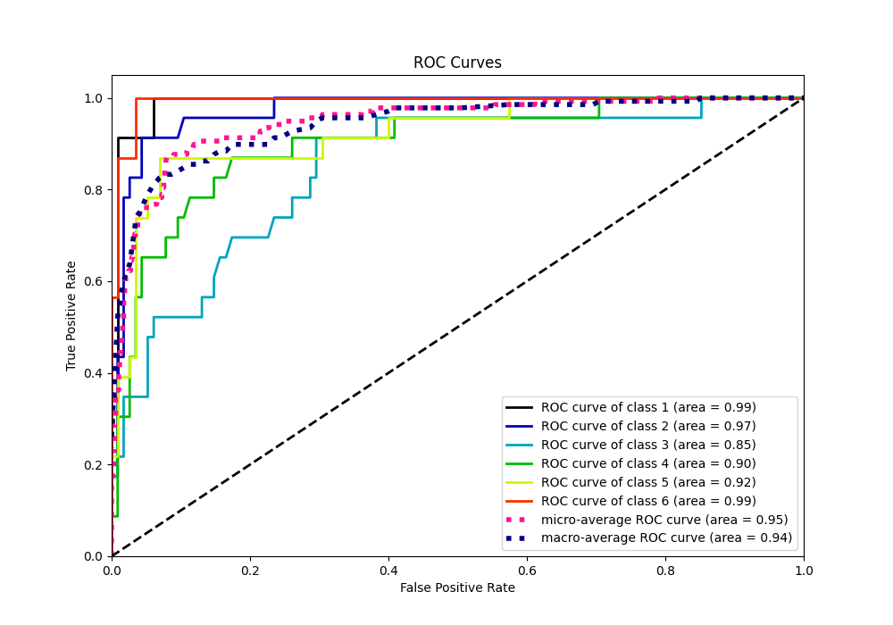

# Summary of 11_Xgboost

[<< Go back](../README.md)

## Extreme Gradient Boosting (Xgboost)
- **n_jobs**: -1
- **objective**: multi:softprob
- **eta**: 0.075
- **max_depth**: 8
- **min_child_weight**: 5
- **subsample**: 1.0
- **colsample_bytree**: 1.0
- **eval_metric**: accuracy
- **num_class**: 6
- **explain_level**: 0

## Validation
 - **validation_type**: kfold
 - **shuffle**: True
 - **stratify**: True
 - **k_folds**: 10

## Optimized metric
accuracy

## Training time

7.6 seconds

### Metric details
|           |         1 |         2 |         3 |         4 |         5 |         6 |   accuracy |   macro avg |   weighted avg |   logloss |
|:----------|----------:|----------:|----------:|----------:|----------:|----------:|-----------:|------------:|---------------:|----------:|
| precision |  0.884615 |  0.909091 |  0.714286 |  0.8      |  0.8      |  0.916667 |    0.84058 |    0.837443 |       0.837443 |  0.971601 |
| recall    |  1        |  0.869565 |  0.652174 |  0.695652 |  0.869565 |  0.956522 |    0.84058 |    0.84058  |       0.84058  |  0.971601 |
| f1-score  |  0.938776 |  0.888889 |  0.681818 |  0.744186 |  0.833333 |  0.93617  |    0.84058 |    0.837195 |       0.837195 |  0.971601 |
| support   | 23        | 23        | 23        | 23        | 23        | 23        |    0.84058 |  138        |     138        |  0.971601 |

## Confusion matrix
|              |   Predicted as 1 |   Predicted as 2 |   Predicted as 3 |   Predicted as 4 |   Predicted as 5 |   Predicted as 6 |
|:-------------|-----------------:|-----------------:|-----------------:|-----------------:|-----------------:|-----------------:|
| Labeled as 1 |               23 |                0 |                0 |                0 |                0 |                0 |
| Labeled as 2 |                1 |               20 |                2 |                0 |                0 |                0 |
| Labeled as 3 |                2 |                2 |               15 |                4 |                0 |                0 |
| Labeled as 4 |                0 |                0 |                3 |               16 |                4 |                0 |
| Labeled as 5 |                0 |                0 |                1 |                0 |               20 |                2 |
| Labeled as 6 |                0 |                0 |                0 |                0 |                1 |               22 |

## Learning curves

## Confusion Matrix

## Normalized Confusion Matrix

## ROC Curve

## Precision Recall Curve

[<< Go back](../README.md)
