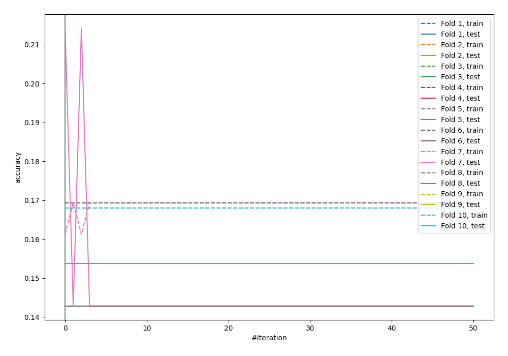
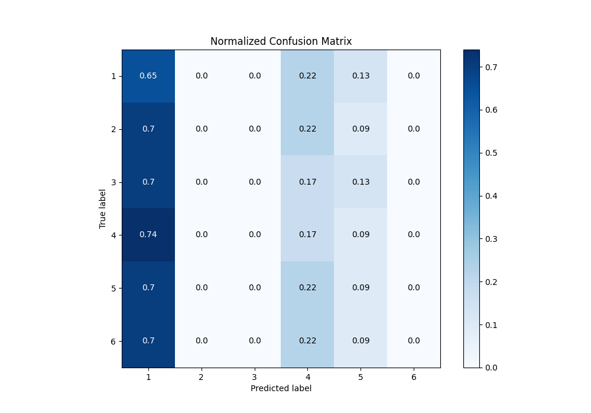
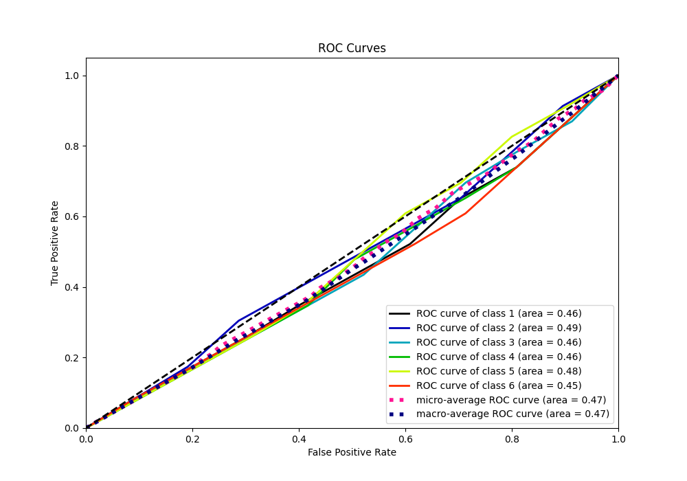
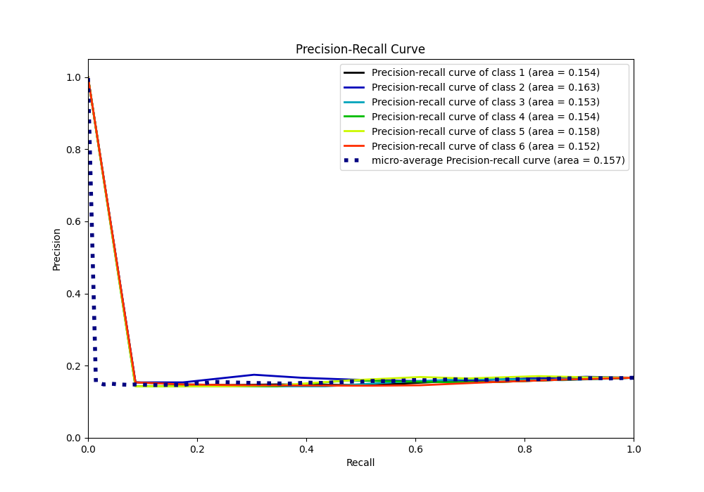

# Summary of 13_Xgboost

[<< Go back](../README.md)

## Extreme Gradient Boosting (Xgboost)
- **n_jobs**: -1
- **objective**: multi:softprob
- **eta**: 0.1
- **max_depth**: 7
- **min_child_weight**: 25
- **subsample**: 0.9
- **colsample_bytree**: 0.6
- **eval_metric**: accuracy
- **num_class**: 6
- **explain_level**: 0

## Validation
 - **validation_type**: kfold
 - **shuffle**: True
 - **stratify**: True
 - **k_folds**: 10

## Optimized metric
accuracy

## Training time

7.8 seconds

### Metric details
|           |         1 |   2 |   3 |         4 |          5 |   6 |   accuracy |   macro avg |   weighted avg |   logloss |
|:----------|----------:|----:|----:|----------:|-----------:|----:|-----------:|------------:|---------------:|----------:|
| precision |  0.15625  |   0 |   0 |  0.142857 |  0.142857  |   0 |   0.152174 |   0.0736607 |      0.0736607 |   1.79204 |
| recall    |  0.652174 |   0 |   0 |  0.173913 |  0.0869565 |   0 |   0.152174 |   0.152174  |      0.152174  |   1.79204 |
| f1-score  |  0.252101 |   0 |   0 |  0.156863 |  0.108108  |   0 |   0.152174 |   0.0861786 |      0.0861786 |   1.79204 |
| support   | 23        |  23 |  23 | 23        | 23         |  23 |   0.152174 | 138         |    138         |   1.79204 |

## Confusion matrix
|              |   Predicted as 1 |   Predicted as 2 |   Predicted as 3 |   Predicted as 4 |   Predicted as 5 |   Predicted as 6 |
|:-------------|-----------------:|-----------------:|-----------------:|-----------------:|-----------------:|-----------------:|
| Labeled as 1 |               15 |                0 |                0 |                5 |                3 |                0 |
| Labeled as 2 |               16 |                0 |                0 |                5 |                2 |                0 |
| Labeled as 3 |               16 |                0 |                0 |                4 |                3 |                0 |
| Labeled as 4 |               17 |                0 |                0 |                4 |                2 |                0 |
| Labeled as 5 |               16 |                0 |                0 |                5 |                2 |                0 |
| Labeled as 6 |               16 |                0 |                0 |                5 |                2 |                0 |

## Learning curves

## Confusion Matrix

## Normalized Confusion Matrix

## ROC Curve

## Precision Recall Curve

[<< Go back](../README.md)
