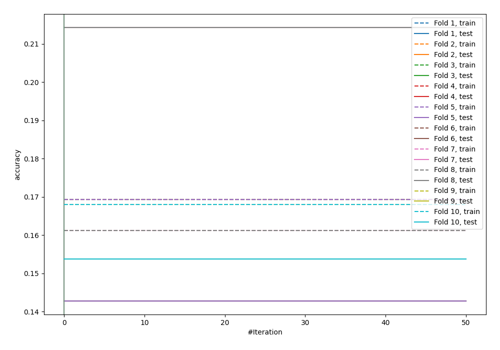
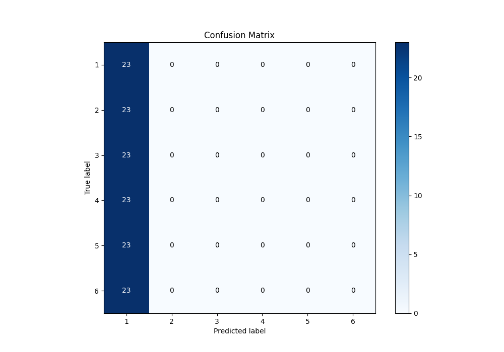
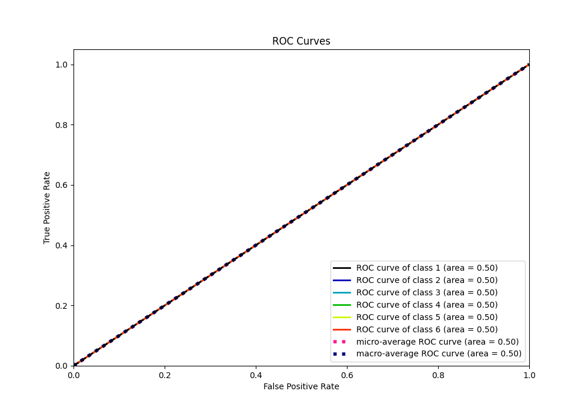
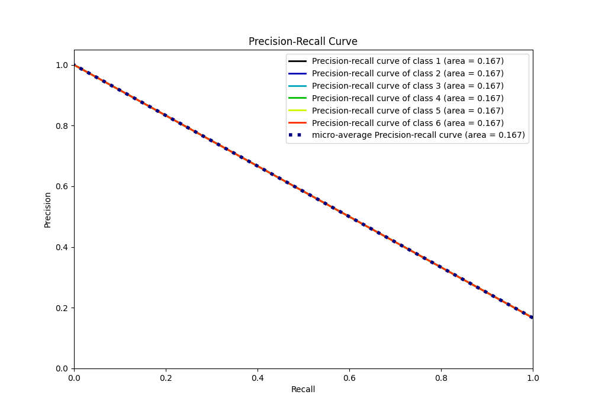

# Summary of 14_Xgboost

[<< Go back](../README.md)

## Extreme Gradient Boosting (Xgboost)
- **n_jobs**: -1
- **objective**: multi:softprob
- **eta**: 0.15
- **max_depth**: 8
- **min_child_weight**: 50
- **subsample**: 0.6
- **colsample_bytree**: 0.6
- **eval_metric**: accuracy
- **num_class**: 6
- **explain_level**: 0

## Validation
 - **validation_type**: kfold
 - **shuffle**: True
 - **stratify**: True
 - **k_folds**: 10

## Optimized metric
accuracy

## Training time

8.1 seconds

### Metric details
|           |         1 |   2 |   3 |   4 |   5 |   6 |   accuracy |   macro avg |   weighted avg |   logloss |
|:----------|----------:|----:|----:|----:|----:|----:|-----------:|------------:|---------------:|----------:|
| precision |  0.166667 |   0 |   0 |   0 |   0 |   0 |   0.166667 |   0.0277778 |      0.0277778 |   1.79176 |
| recall    |  1        |   0 |   0 |   0 |   0 |   0 |   0.166667 |   0.166667  |      0.166667  |   1.79176 |
| f1-score  |  0.285714 |   0 |   0 |   0 |   0 |   0 |   0.166667 |   0.047619  |      0.047619  |   1.79176 |
| support   | 23        |  23 |  23 |  23 |  23 |  23 |   0.166667 | 138         |    138         |   1.79176 |

## Confusion matrix
|              |   Predicted as 1 |   Predicted as 2 |   Predicted as 3 |   Predicted as 4 |   Predicted as 5 |   Predicted as 6 |
|:-------------|-----------------:|-----------------:|-----------------:|-----------------:|-----------------:|-----------------:|
| Labeled as 1 |               23 |                0 |                0 |                0 |                0 |                0 |
| Labeled as 2 |               23 |                0 |                0 |                0 |                0 |                0 |
| Labeled as 3 |               23 |                0 |                0 |                0 |                0 |                0 |
| Labeled as 4 |               23 |                0 |                0 |                0 |                0 |                0 |
| Labeled as 5 |               23 |                0 |                0 |                0 |                0 |                0 |
| Labeled as 6 |               23 |                0 |                0 |                0 |                0 |                0 |

## Learning curves

## Confusion Matrix

## Normalized Confusion Matrix

## ROC Curve

## Precision Recall Curve

[<< Go back](../README.md)
