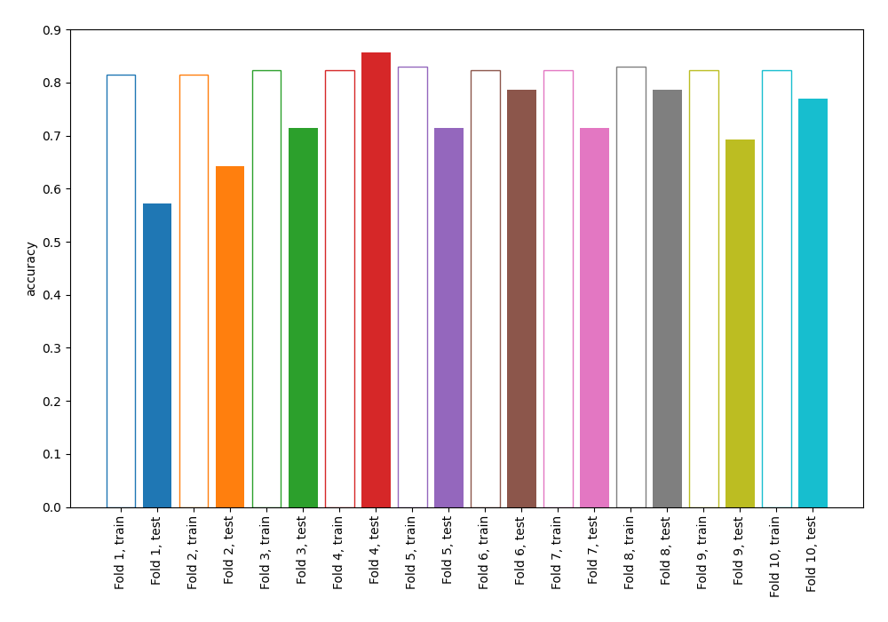

# Summary of 1_DecisionTree

[<< Go back](../README.md)

## Decision Tree
- **n_jobs**: -1
- **criterion**: gini
- **max_depth**: 3
- **num_class**: 6
- **explain_level**: 0

## Validation
 - **validation_type**: kfold
 - **shuffle**: True
 - **stratify**: True
 - **k_folds**: 10

## Optimized metric
accuracy

## Training time

3.5 seconds

### Metric details
|           |         1 |         2 |        3 |         4 |         5 |         6 |   accuracy |   macro avg |   weighted avg |   logloss |
|:----------|----------:|----------:|---------:|----------:|----------:|----------:|-----------:|------------:|---------------:|----------:|
| precision |  0.956522 |  0.8      |  0.3     |  0.454545 |  0.833333 |  0.916667 |   0.724638 |    0.710178 |       0.710178 |   1.29071 |
| recall    |  0.956522 |  0.869565 |  0.26087 |  0.434783 |  0.869565 |  0.956522 |   0.724638 |    0.724638 |       0.724638 |   1.29071 |
| f1-score  |  0.956522 |  0.833333 |  0.27907 |  0.444444 |  0.851064 |  0.93617  |   0.724638 |    0.716767 |       0.716767 |   1.29071 |
| support   | 23        | 23        | 23       | 23        | 23        | 23        |   0.724638 |  138        |     138        |   1.29071 |

## Confusion matrix
|              |   Predicted as 1 |   Predicted as 2 |   Predicted as 3 |   Predicted as 4 |   Predicted as 5 |   Predicted as 6 |
|:-------------|-----------------:|-----------------:|-----------------:|-----------------:|-----------------:|-----------------:|
| Labeled as 1 |               22 |                1 |                0 |                0 |                0 |                0 |
| Labeled as 2 |                0 |               20 |                3 |                0 |                0 |                0 |
| Labeled as 3 |                1 |                4 |                6 |               12 |                0 |                0 |
| Labeled as 4 |                0 |                0 |               10 |               10 |                3 |                0 |
| Labeled as 5 |                0 |                0 |                1 |                0 |               20 |                2 |
| Labeled as 6 |                0 |                0 |                0 |                0 |                1 |               22 |

## Learning curves

## Confusion Matrix

## Normalized Confusion Matrix

## ROC Curve

## Precision Recall Curve

[<< Go back](../README.md)
