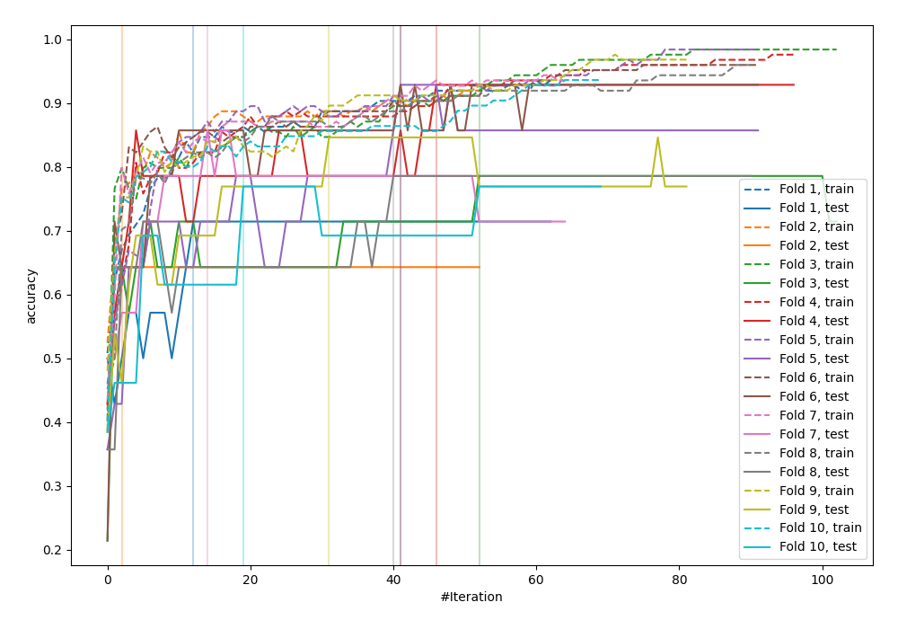
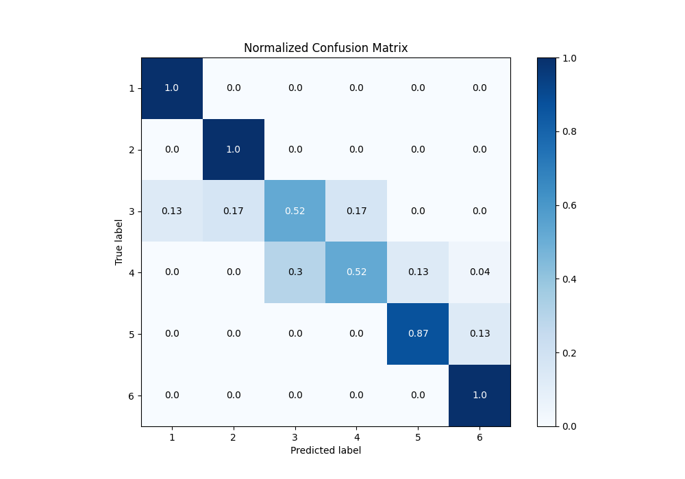
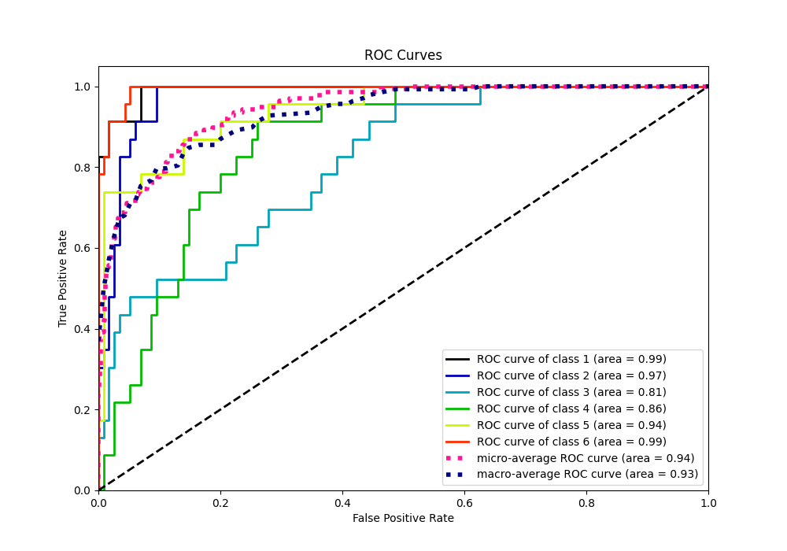
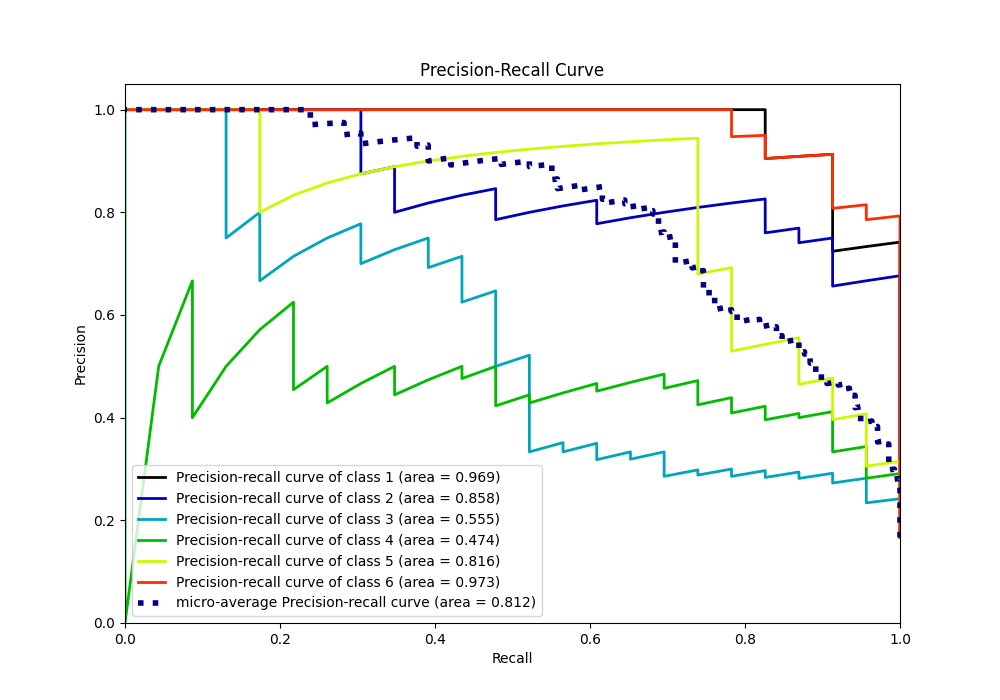

# Summary of 20_LightGBM

[<< Go back](../README.md)

## LightGBM
- **n_jobs**: -1
- **objective**: multiclass
- **num_leaves**: 15
- **learning_rate**: 0.05
- **feature_fraction**: 0.8
- **bagging_fraction**: 0.5
- **min_data_in_leaf**: 50
- **metric**: custom
- **custom_eval_metric_name**: accuracy
- **num_class**: 6
- **explain_level**: 0

## Validation
 - **validation_type**: kfold
 - **shuffle**: True
 - **stratify**: True
 - **k_folds**: 10

## Optimized metric
accuracy

## Training time

5.2 seconds

### Metric details
|           |         1 |         2 |         3 |         4 |         5 |         6 |   accuracy |   macro avg |   weighted avg |   logloss |
|:----------|----------:|----------:|----------:|----------:|----------:|----------:|-----------:|------------:|---------------:|----------:|
| precision |  0.884615 |  0.851852 |  0.631579 |  0.75     |  0.869565 |  0.851852 |   0.818841 |    0.806577 |       0.806577 |   0.94454 |
| recall    |  1        |  1        |  0.521739 |  0.521739 |  0.869565 |  1        |   0.818841 |    0.818841 |       0.818841 |   0.94454 |
| f1-score  |  0.938776 |  0.92     |  0.571429 |  0.615385 |  0.869565 |  0.92     |   0.818841 |    0.805859 |       0.805859 |   0.94454 |
| support   | 23        | 23        | 23        | 23        | 23        | 23        |   0.818841 |  138        |     138        |   0.94454 |

## Confusion matrix
|              |   Predicted as 1 |   Predicted as 2 |   Predicted as 3 |   Predicted as 4 |   Predicted as 5 |   Predicted as 6 |
|:-------------|-----------------:|-----------------:|-----------------:|-----------------:|-----------------:|-----------------:|
| Labeled as 1 |               23 |                0 |                0 |                0 |                0 |                0 |
| Labeled as 2 |                0 |               23 |                0 |                0 |                0 |                0 |
| Labeled as 3 |                3 |                4 |               12 |                4 |                0 |                0 |
| Labeled as 4 |                0 |                0 |                7 |               12 |                3 |                1 |
| Labeled as 5 |                0 |                0 |                0 |                0 |               20 |                3 |
| Labeled as 6 |                0 |                0 |                0 |                0 |                0 |               23 |

## Learning curves

## Confusion Matrix

## Normalized Confusion Matrix

## ROC Curve

## Precision Recall Curve

[<< Go back](../README.md)
