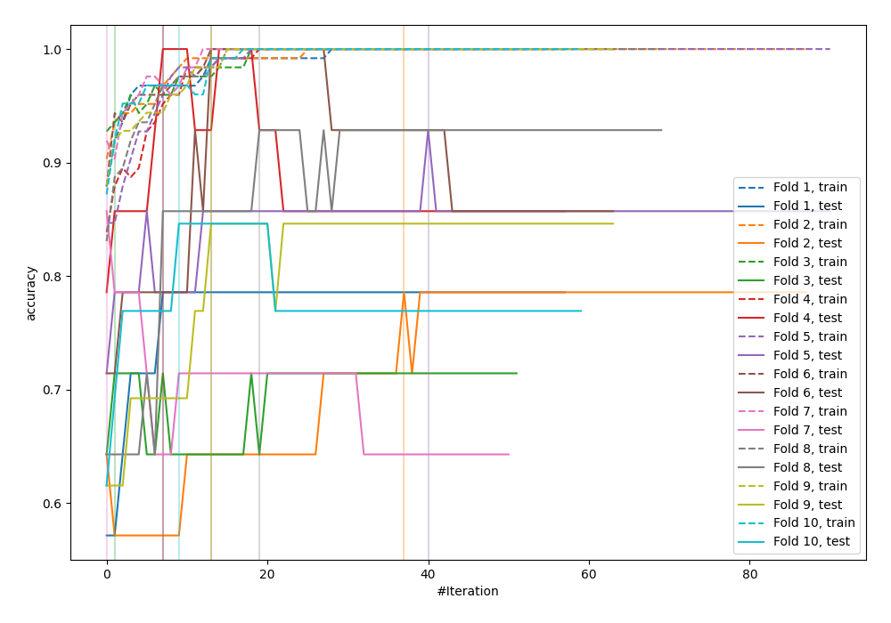
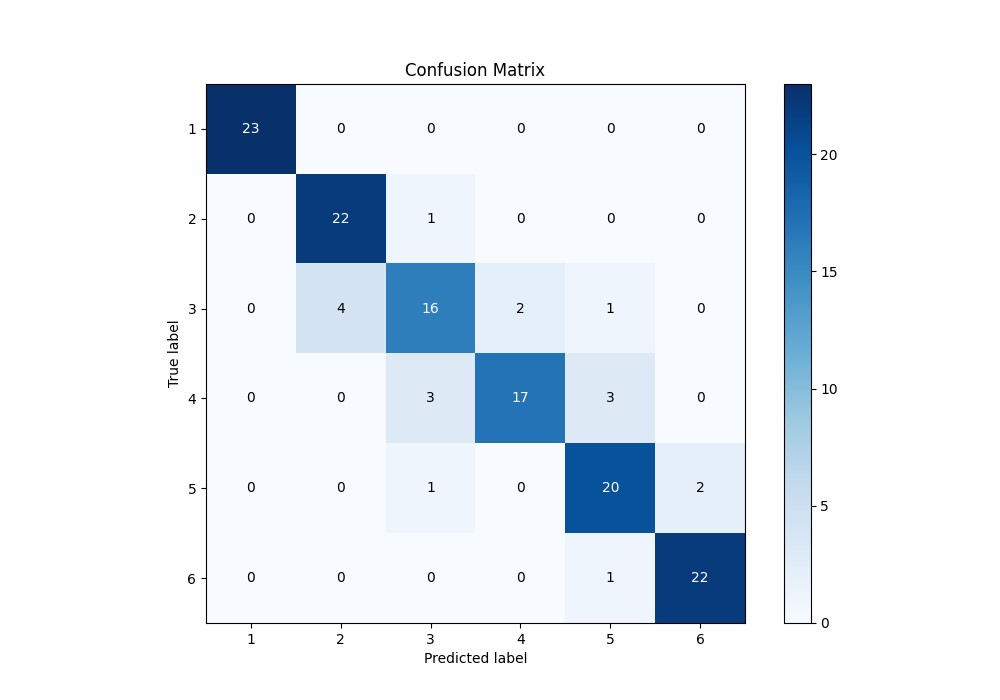
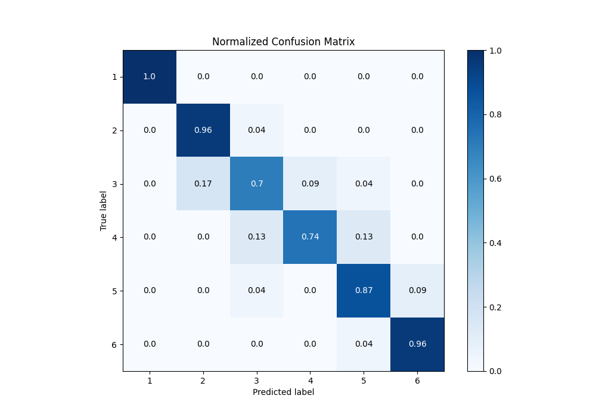
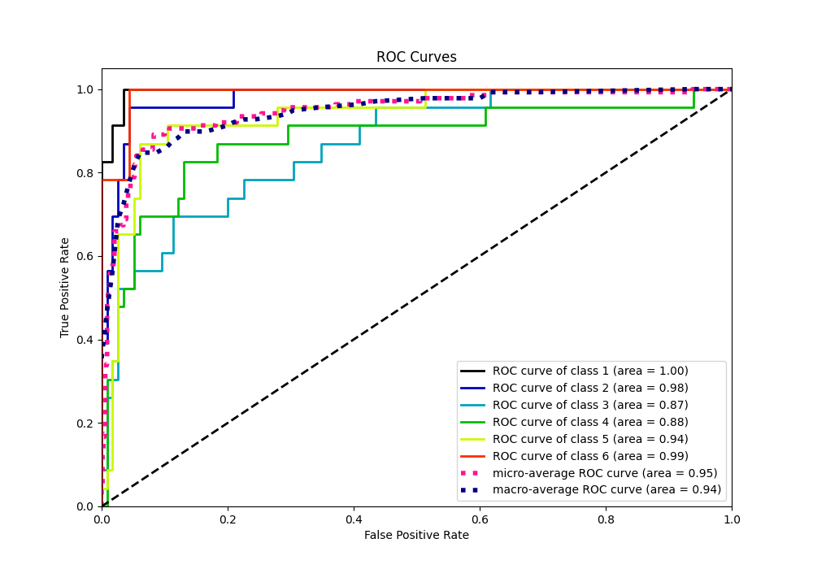
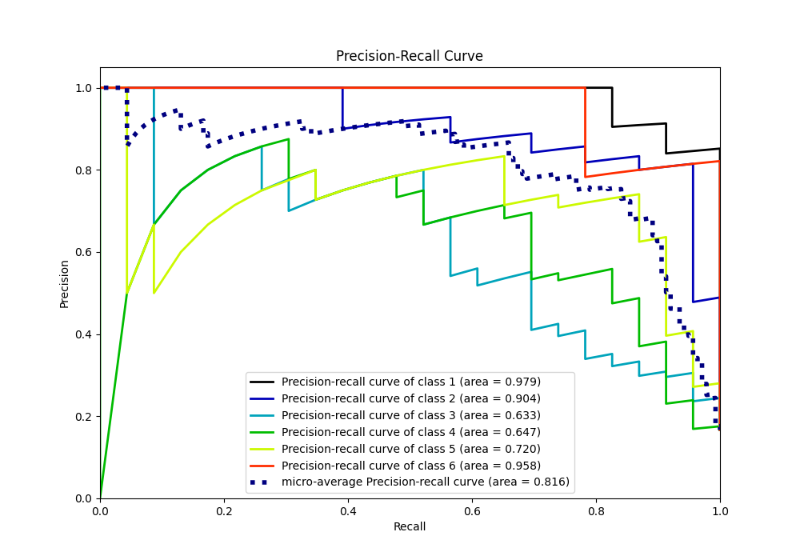

# Summary of 23_LightGBM

[<< Go back](../README.md)

## LightGBM
- **n_jobs**: -1
- **objective**: multiclass
- **num_leaves**: 95
- **learning_rate**: 0.05
- **feature_fraction**: 1.0
- **bagging_fraction**: 1.0
- **min_data_in_leaf**: 10
- **metric**: custom
- **custom_eval_metric_name**: accuracy
- **num_class**: 6
- **explain_level**: 0

## Validation
 - **validation_type**: kfold
 - **shuffle**: True
 - **stratify**: True
 - **k_folds**: 10

## Optimized metric
accuracy

## Training time

9.3 seconds

### Metric details
|           |   1 |         2 |         3 |         4 |         5 |         6 |   accuracy |   macro avg |   weighted avg |   logloss |
|:----------|----:|----------:|----------:|----------:|----------:|----------:|-----------:|------------:|---------------:|----------:|
| precision |   1 |  0.846154 |  0.761905 |  0.894737 |  0.8      |  0.916667 |   0.869565 |    0.86991  |       0.86991  |  0.992024 |
| recall    |   1 |  0.956522 |  0.695652 |  0.73913  |  0.869565 |  0.956522 |   0.869565 |    0.869565 |       0.869565 |  0.992024 |
| f1-score  |   1 |  0.897959 |  0.727273 |  0.809524 |  0.833333 |  0.93617  |   0.869565 |    0.867377 |       0.867377 |  0.992024 |
| support   |  23 | 23        | 23        | 23        | 23        | 23        |   0.869565 |  138        |     138        |  0.992024 |

## Confusion matrix
|              |   Predicted as 1 |   Predicted as 2 |   Predicted as 3 |   Predicted as 4 |   Predicted as 5 |   Predicted as 6 |
|:-------------|-----------------:|-----------------:|-----------------:|-----------------:|-----------------:|-----------------:|
| Labeled as 1 |               23 |                0 |                0 |                0 |                0 |                0 |
| Labeled as 2 |                0 |               22 |                1 |                0 |                0 |                0 |
| Labeled as 3 |                0 |                4 |               16 |                2 |                1 |                0 |
| Labeled as 4 |                0 |                0 |                3 |               17 |                3 |                0 |
| Labeled as 5 |                0 |                0 |                1 |                0 |               20 |                2 |
| Labeled as 6 |                0 |                0 |                0 |                0 |                1 |               22 |

## Learning curves

## Confusion Matrix

## Normalized Confusion Matrix

## ROC Curve

## Precision Recall Curve

[<< Go back](../README.md)
