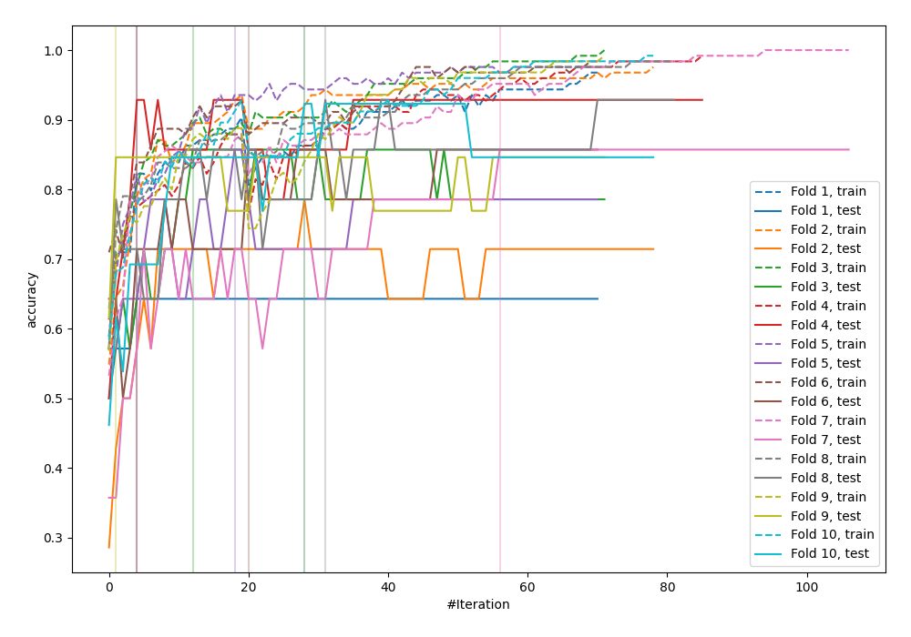
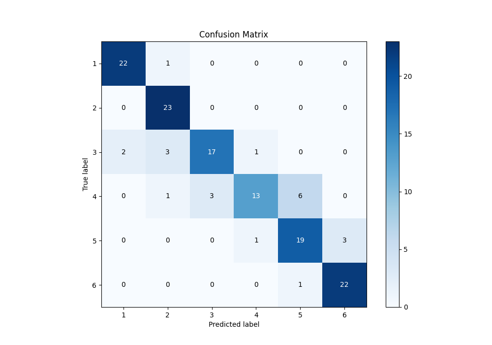
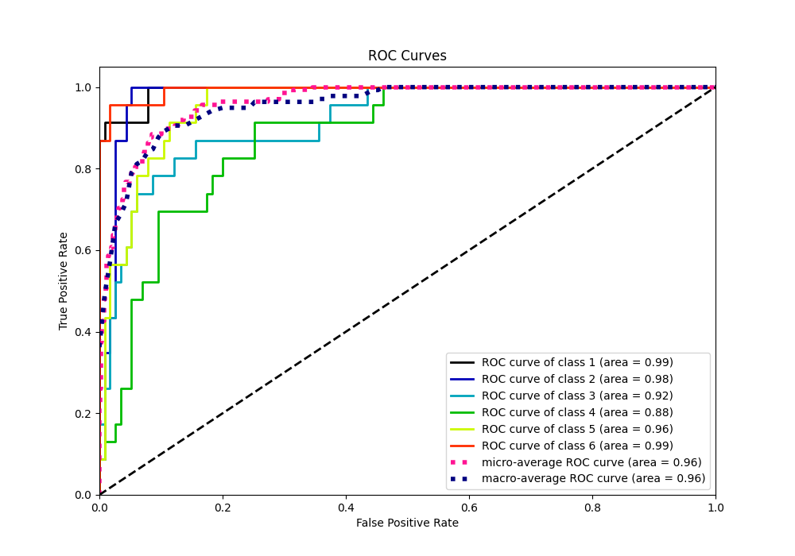
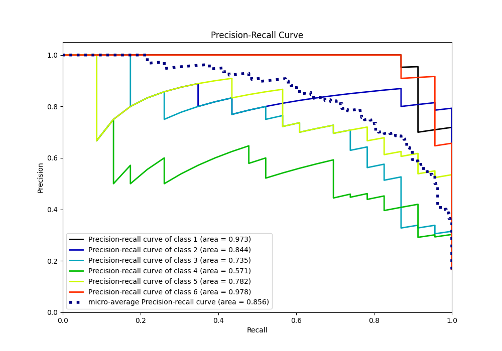

# Summary of 29_CatBoost

[<< Go back](../README.md)

## CatBoost
- **n_jobs**: -1
- **learning_rate**: 0.15
- **depth**: 3
- **rsm**: 0.8
- **loss_function**: MultiClass
- **eval_metric**: Accuracy
- **num_class**: 6
- **explain_level**: 0

## Validation
 - **validation_type**: kfold
 - **shuffle**: True
 - **stratify**: True
 - **k_folds**: 10

## Optimized metric
accuracy

## Training time

14.3 seconds

### Metric details
|           |         1 |         2 |         3 |         4 |         5 |         6 |   accuracy |   macro avg |   weighted avg |   logloss |
|:----------|----------:|----------:|----------:|----------:|----------:|----------:|-----------:|------------:|---------------:|----------:|
| precision |  0.916667 |  0.821429 |  0.85     |  0.866667 |  0.730769 |  0.88     |    0.84058 |    0.844255 |       0.844255 |  0.940371 |
| recall    |  0.956522 |  1        |  0.73913  |  0.565217 |  0.826087 |  0.956522 |    0.84058 |    0.84058  |       0.84058  |  0.940371 |
| f1-score  |  0.93617  |  0.901961 |  0.790698 |  0.684211 |  0.77551  |  0.916667 |    0.84058 |    0.834203 |       0.834203 |  0.940371 |
| support   | 23        | 23        | 23        | 23        | 23        | 23        |    0.84058 |  138        |     138        |  0.940371 |

## Confusion matrix
|              |   Predicted as 1 |   Predicted as 2 |   Predicted as 3 |   Predicted as 4 |   Predicted as 5 |   Predicted as 6 |
|:-------------|-----------------:|-----------------:|-----------------:|-----------------:|-----------------:|-----------------:|
| Labeled as 1 |               22 |                1 |                0 |                0 |                0 |                0 |
| Labeled as 2 |                0 |               23 |                0 |                0 |                0 |                0 |
| Labeled as 3 |                2 |                3 |               17 |                1 |                0 |                0 |
| Labeled as 4 |                0 |                1 |                3 |               13 |                6 |                0 |
| Labeled as 5 |                0 |                0 |                0 |                1 |               19 |                3 |
| Labeled as 6 |                0 |                0 |                0 |                0 |                1 |               22 |

## Learning curves

## Confusion Matrix

## Normalized Confusion Matrix

## ROC Curve

## Precision Recall Curve

[<< Go back](../README.md)
