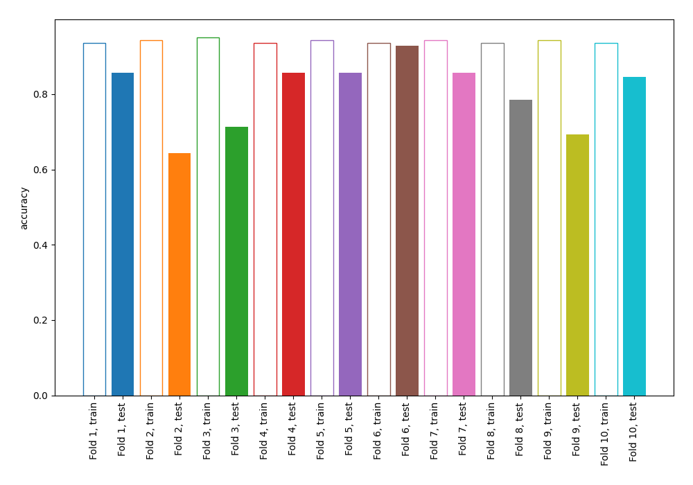
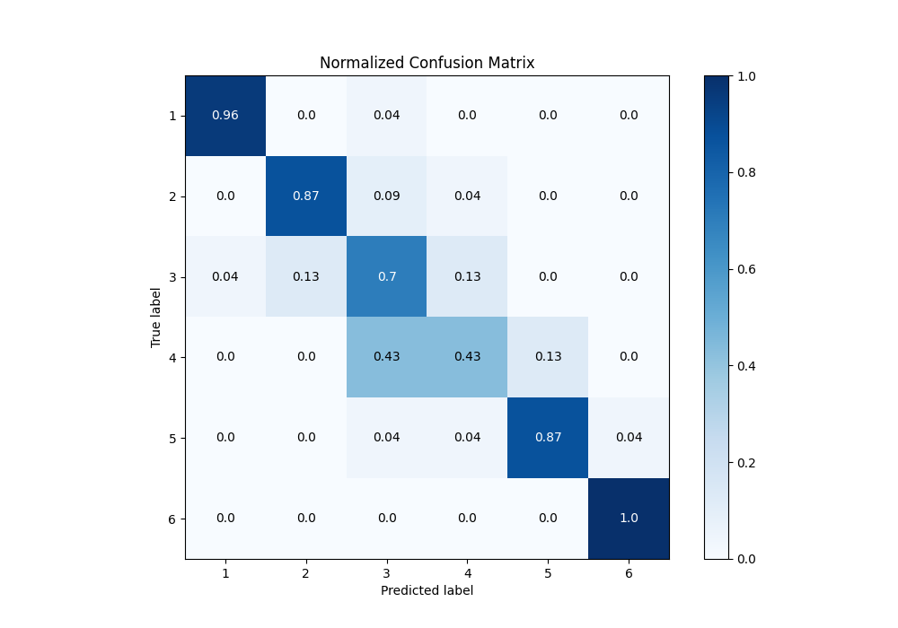
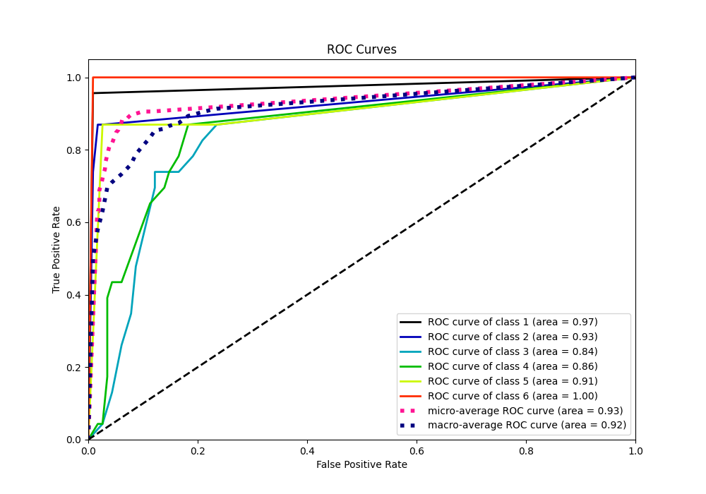
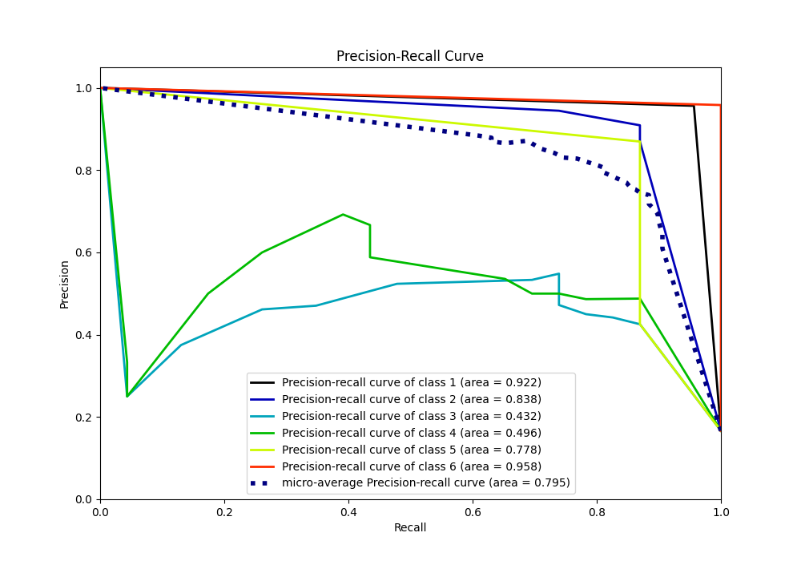

# Summary of 2_DecisionTree

[<< Go back](../README.md)

## Decision Tree
- **n_jobs**: -1
- **criterion**: gini
- **max_depth**: 4
- **num_class**: 6
- **explain_level**: 0

## Validation
 - **validation_type**: kfold
 - **shuffle**: True
 - **stratify**: True
 - **k_folds**: 10

## Optimized metric
accuracy

## Training time

3.0 seconds

### Metric details
|           |         1 |         2 |         3 |         4 |         5 |         6 |   accuracy |   macro avg |   weighted avg |   logloss |
|:----------|----------:|----------:|----------:|----------:|----------:|----------:|-----------:|------------:|---------------:|----------:|
| precision |  0.956522 |  0.869565 |  0.533333 |  0.666667 |  0.869565 |  0.958333 |   0.804348 |    0.808998 |       0.808998 |   1.71688 |
| recall    |  0.956522 |  0.869565 |  0.695652 |  0.434783 |  0.869565 |  1        |   0.804348 |    0.804348 |       0.804348 |   1.71688 |
| f1-score  |  0.956522 |  0.869565 |  0.603774 |  0.526316 |  0.869565 |  0.978723 |   0.804348 |    0.800744 |       0.800744 |   1.71688 |
| support   | 23        | 23        | 23        | 23        | 23        | 23        |   0.804348 |  138        |     138        |   1.71688 |

## Confusion matrix
|              |   Predicted as 1 |   Predicted as 2 |   Predicted as 3 |   Predicted as 4 |   Predicted as 5 |   Predicted as 6 |
|:-------------|-----------------:|-----------------:|-----------------:|-----------------:|-----------------:|-----------------:|
| Labeled as 1 |               22 |                0 |                1 |                0 |                0 |                0 |
| Labeled as 2 |                0 |               20 |                2 |                1 |                0 |                0 |
| Labeled as 3 |                1 |                3 |               16 |                3 |                0 |                0 |
| Labeled as 4 |                0 |                0 |               10 |               10 |                3 |                0 |
| Labeled as 5 |                0 |                0 |                1 |                1 |               20 |                1 |
| Labeled as 6 |                0 |                0 |                0 |                0 |                0 |               23 |

## Learning curves

## Confusion Matrix

## Normalized Confusion Matrix

## ROC Curve

## Precision Recall Curve

[<< Go back](../README.md)
