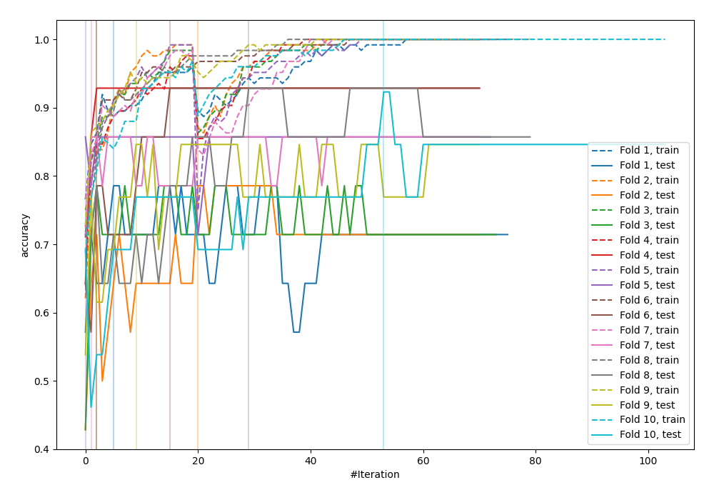
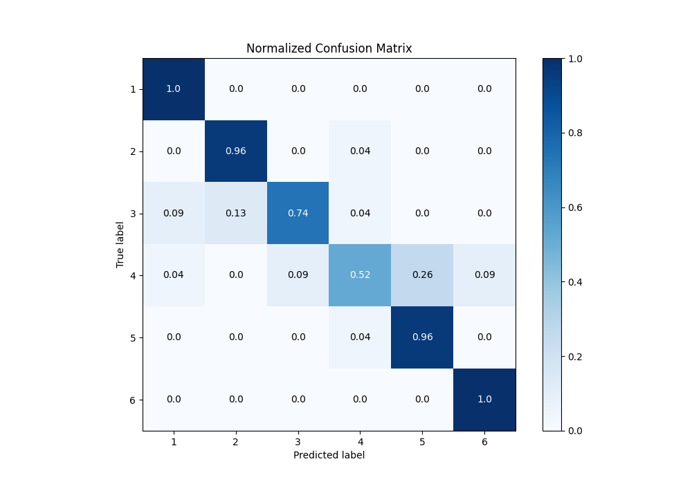
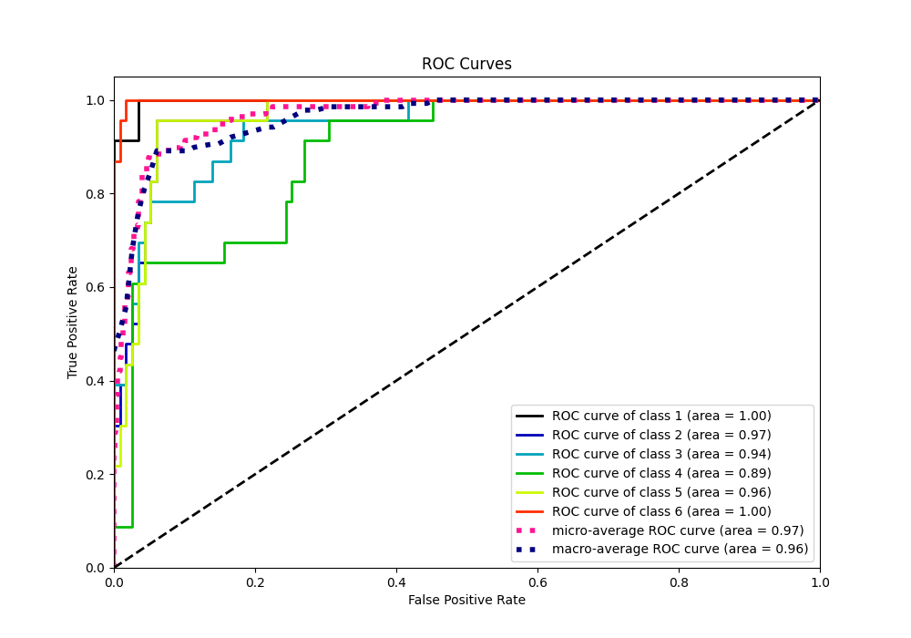
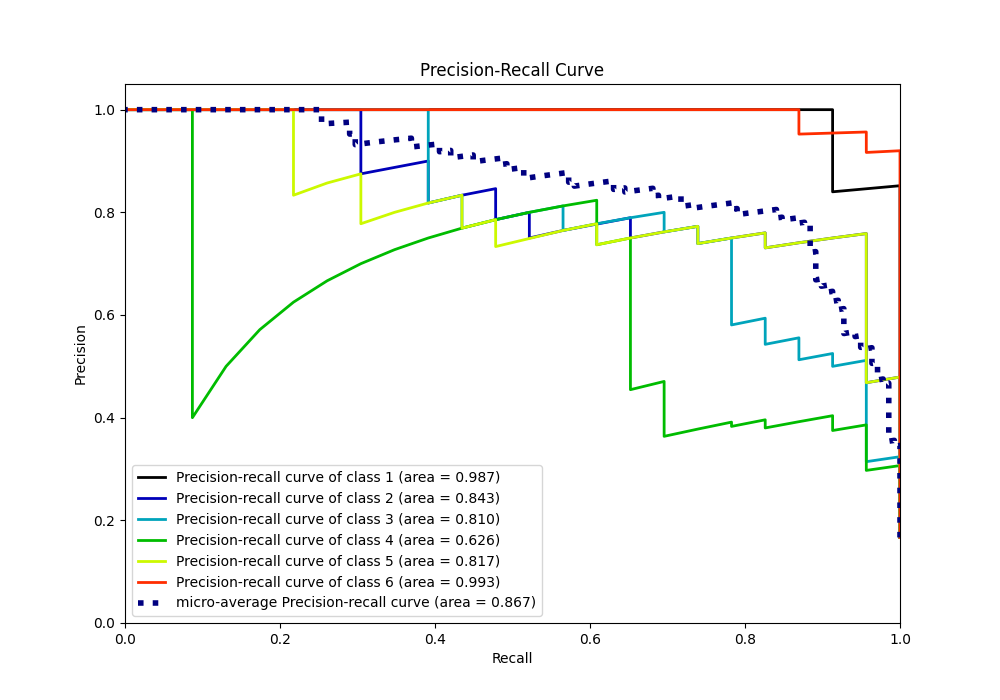

# Summary of 30_CatBoost

[<< Go back](../README.md)

## CatBoost
- **n_jobs**: -1
- **learning_rate**: 0.2
- **depth**: 5
- **rsm**: 0.7
- **loss_function**: MultiClass
- **eval_metric**: Accuracy
- **num_class**: 6
- **explain_level**: 0

## Validation
 - **validation_type**: kfold
 - **shuffle**: True
 - **stratify**: True
 - **k_folds**: 10

## Optimized metric
accuracy

## Training time

32.9 seconds

### Metric details
|           |         1 |         2 |         3 |         4 |         5 |         6 |   accuracy |   macro avg |   weighted avg |   logloss |
|:----------|----------:|----------:|----------:|----------:|----------:|----------:|-----------:|------------:|---------------:|----------:|
| precision |  0.884615 |  0.88     |  0.894737 |  0.8      |  0.785714 |  0.92     |   0.862319 |    0.860844 |       0.860844 |  0.980118 |
| recall    |  1        |  0.956522 |  0.73913  |  0.521739 |  0.956522 |  1        |   0.862319 |    0.862319 |       0.862319 |  0.980118 |
| f1-score  |  0.938776 |  0.916667 |  0.809524 |  0.631579 |  0.862745 |  0.958333 |   0.862319 |    0.852937 |       0.852937 |  0.980118 |
| support   | 23        | 23        | 23        | 23        | 23        | 23        |   0.862319 |  138        |     138        |  0.980118 |

## Confusion matrix
|              |   Predicted as 1 |   Predicted as 2 |   Predicted as 3 |   Predicted as 4 |   Predicted as 5 |   Predicted as 6 |
|:-------------|-----------------:|-----------------:|-----------------:|-----------------:|-----------------:|-----------------:|
| Labeled as 1 |               23 |                0 |                0 |                0 |                0 |                0 |
| Labeled as 2 |                0 |               22 |                0 |                1 |                0 |                0 |
| Labeled as 3 |                2 |                3 |               17 |                1 |                0 |                0 |
| Labeled as 4 |                1 |                0 |                2 |               12 |                6 |                2 |
| Labeled as 5 |                0 |                0 |                0 |                1 |               22 |                0 |
| Labeled as 6 |                0 |                0 |                0 |                0 |                0 |               23 |

## Learning curves

## Confusion Matrix

## Normalized Confusion Matrix

## ROC Curve

## Precision Recall Curve

[<< Go back](../README.md)
