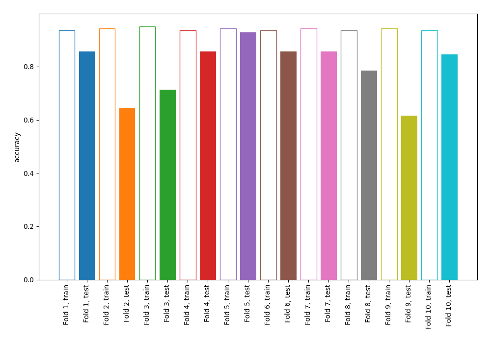
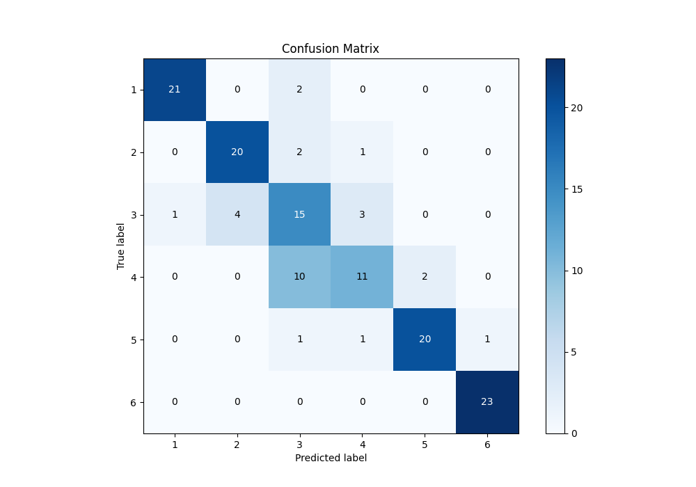
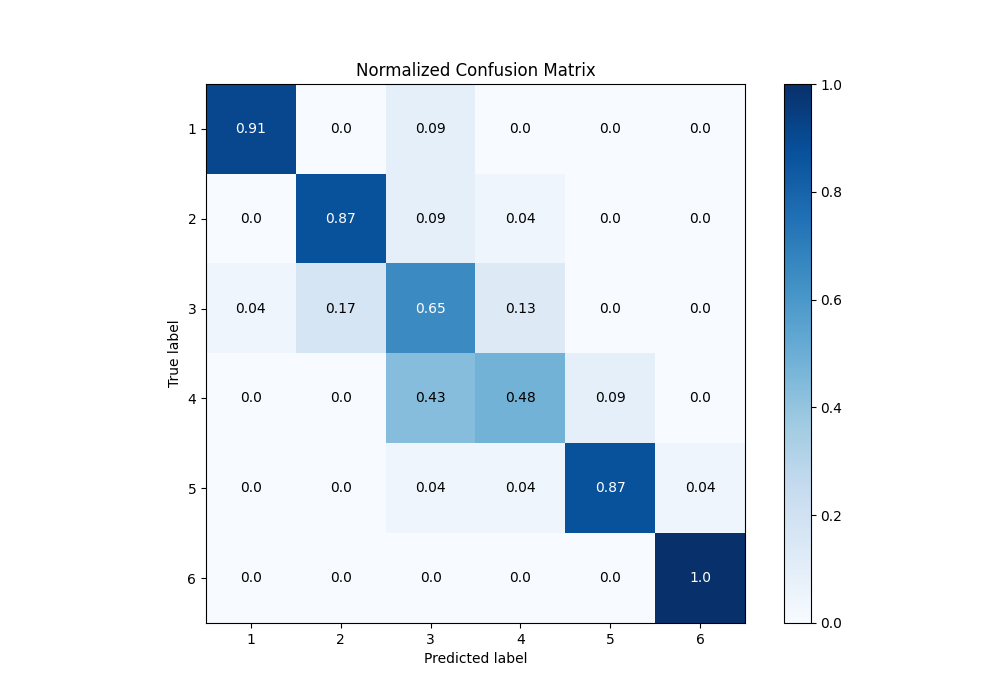
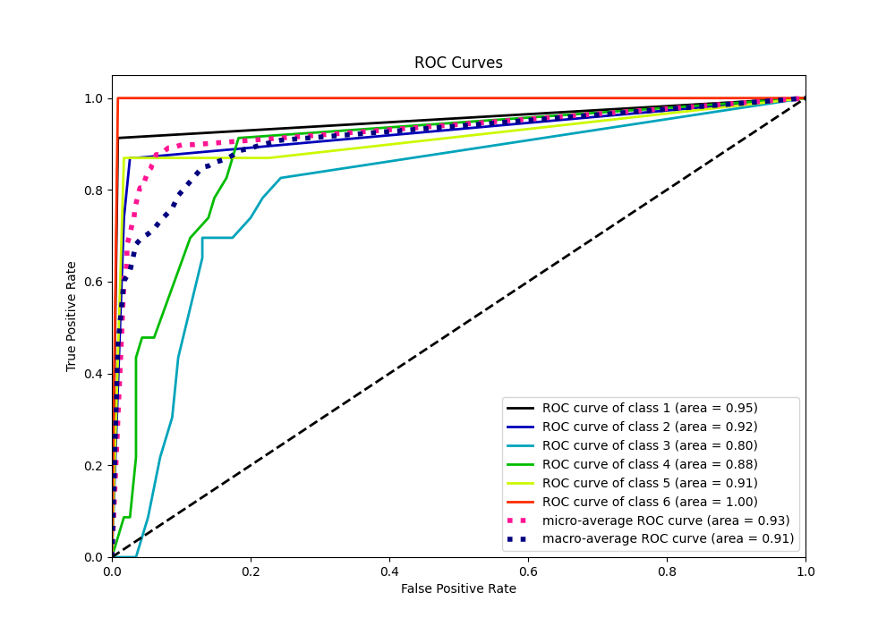
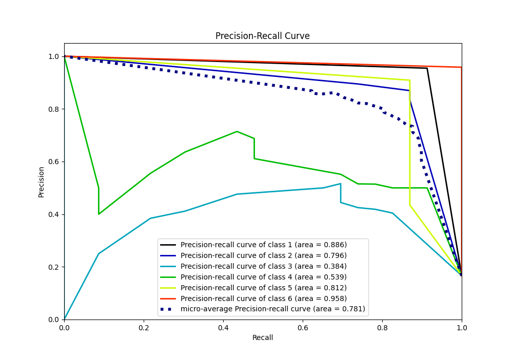

# Summary of 3_DecisionTree

[<< Go back](../README.md)

## Decision Tree
- **n_jobs**: -1
- **criterion**: gini
- **max_depth**: 4
- **num_class**: 6
- **explain_level**: 0

## Validation
 - **validation_type**: kfold
 - **shuffle**: True
 - **stratify**: True
 - **k_folds**: 10

## Optimized metric
accuracy

## Training time

3.1 seconds

### Metric details
|           |         1 |         2 |         3 |         4 |         5 |         6 |   accuracy |   macro avg |   weighted avg |   logloss |
|:----------|----------:|----------:|----------:|----------:|----------:|----------:|-----------:|------------:|---------------:|----------:|
| precision |  0.954545 |  0.833333 |  0.5      |  0.6875   |  0.909091 |  0.958333 |   0.797101 |    0.807134 |       0.807134 |    1.8324 |
| recall    |  0.913043 |  0.869565 |  0.652174 |  0.478261 |  0.869565 |  1        |   0.797101 |    0.797101 |       0.797101 |    1.8324 |
| f1-score  |  0.933333 |  0.851064 |  0.566038 |  0.564103 |  0.888889 |  0.978723 |   0.797101 |    0.797025 |       0.797025 |    1.8324 |
| support   | 23        | 23        | 23        | 23        | 23        | 23        |   0.797101 |  138        |     138        |    1.8324 |

## Confusion matrix
|              |   Predicted as 1 |   Predicted as 2 |   Predicted as 3 |   Predicted as 4 |   Predicted as 5 |   Predicted as 6 |
|:-------------|-----------------:|-----------------:|-----------------:|-----------------:|-----------------:|-----------------:|
| Labeled as 1 |               21 |                0 |                2 |                0 |                0 |                0 |
| Labeled as 2 |                0 |               20 |                2 |                1 |                0 |                0 |
| Labeled as 3 |                1 |                4 |               15 |                3 |                0 |                0 |
| Labeled as 4 |                0 |                0 |               10 |               11 |                2 |                0 |
| Labeled as 5 |                0 |                0 |                1 |                1 |               20 |                1 |
| Labeled as 6 |                0 |                0 |                0 |                0 |                0 |               23 |

## Learning curves

## Confusion Matrix

## Normalized Confusion Matrix

## ROC Curve

## Precision Recall Curve

[<< Go back](../README.md)
