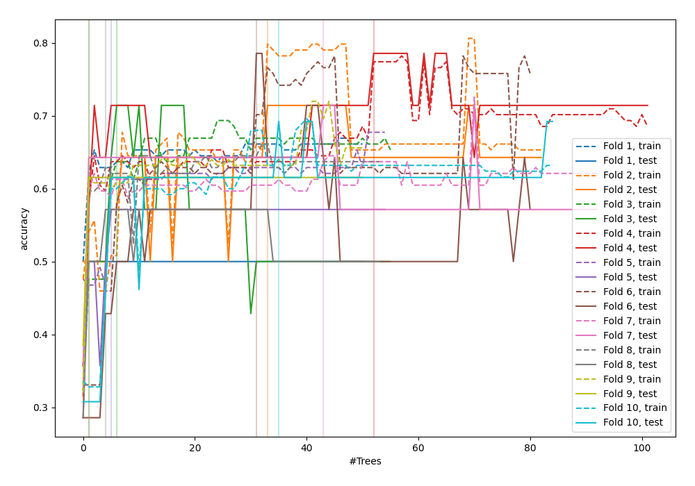
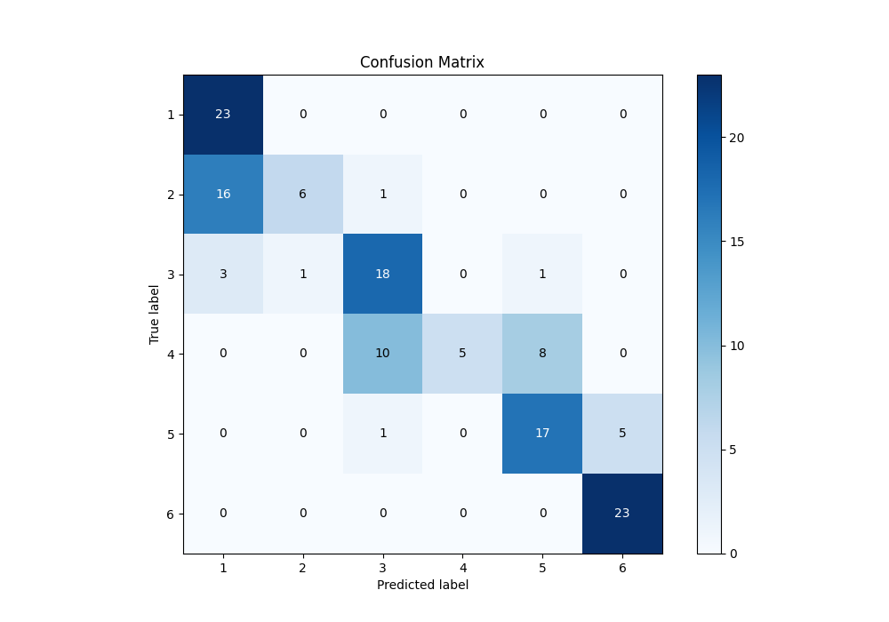
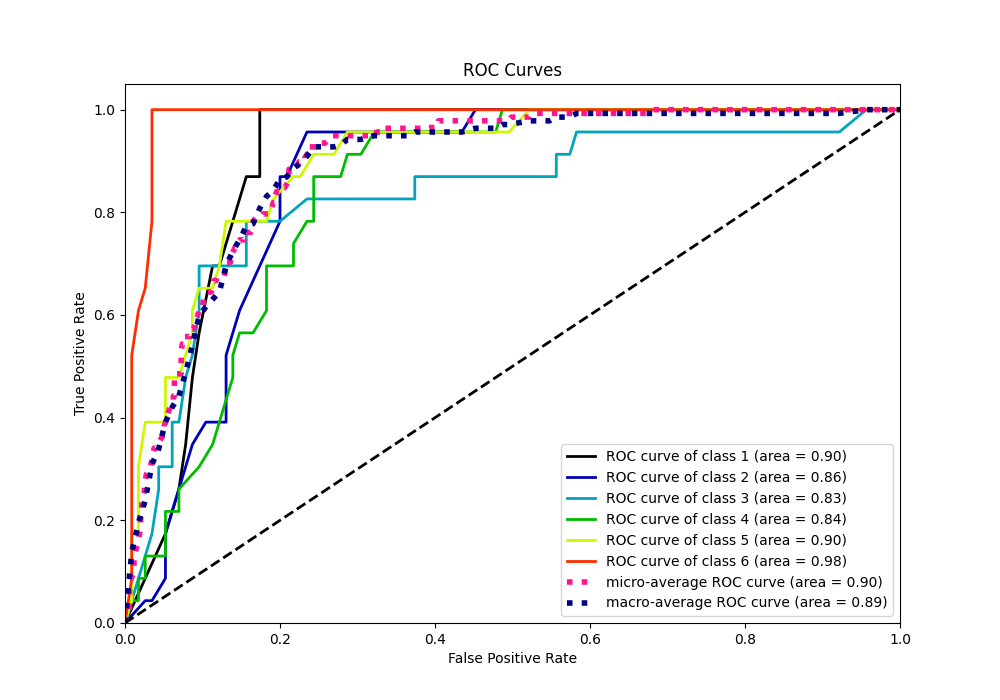
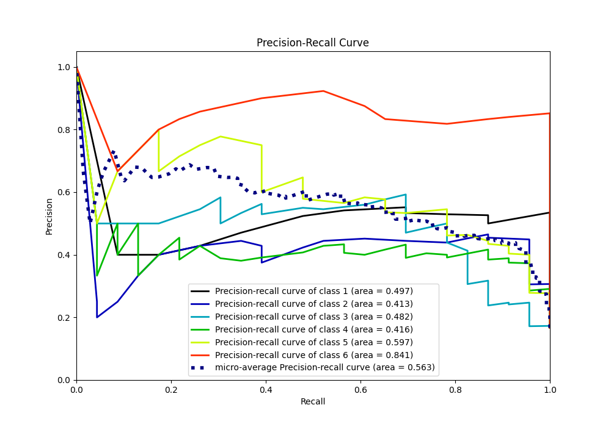

# Summary of 41_RandomForest

[<< Go back](../README.md)

## Random Forest
- **n_jobs**: -1
- **criterion**: entropy
- **max_features**: 0.6
- **min_samples_split**: 50
- **max_depth**: 6
- **eval_metric_name**: accuracy
- **num_class**: 6
- **explain_level**: 0

## Validation
 - **validation_type**: kfold
 - **shuffle**: True
 - **stratify**: True
 - **k_folds**: 10

## Optimized metric
accuracy

## Training time

15.2 seconds

### Metric details
|           |         1 |         2 |         3 |         4 |         5 |         6 |   accuracy |   macro avg |   weighted avg |   logloss |
|:----------|----------:|----------:|----------:|----------:|----------:|----------:|-----------:|------------:|---------------:|----------:|
| precision |  0.547619 |  0.857143 |  0.6      |  1        |  0.653846 |  0.821429 |   0.666667 |    0.746673 |       0.746673 |   1.09035 |
| recall    |  1        |  0.26087  |  0.782609 |  0.217391 |  0.73913  |  1        |   0.666667 |    0.666667 |       0.666667 |   1.09035 |
| f1-score  |  0.707692 |  0.4      |  0.679245 |  0.357143 |  0.693878 |  0.901961 |   0.666667 |    0.62332  |       0.62332  |   1.09035 |
| support   | 23        | 23        | 23        | 23        | 23        | 23        |   0.666667 |  138        |     138        |   1.09035 |

## Confusion matrix
|              |   Predicted as 1 |   Predicted as 2 |   Predicted as 3 |   Predicted as 4 |   Predicted as 5 |   Predicted as 6 |
|:-------------|-----------------:|-----------------:|-----------------:|-----------------:|-----------------:|-----------------:|
| Labeled as 1 |               23 |                0 |                0 |                0 |                0 |                0 |
| Labeled as 2 |               16 |                6 |                1 |                0 |                0 |                0 |
| Labeled as 3 |                3 |                1 |               18 |                0 |                1 |                0 |
| Labeled as 4 |                0 |                0 |               10 |                5 |                8 |                0 |
| Labeled as 5 |                0 |                0 |                1 |                0 |               17 |                5 |
| Labeled as 6 |                0 |                0 |                0 |                0 |                0 |               23 |

## Learning curves

## Confusion Matrix

## Normalized Confusion Matrix

## ROC Curve

## Precision Recall Curve

[<< Go back](../README.md)
