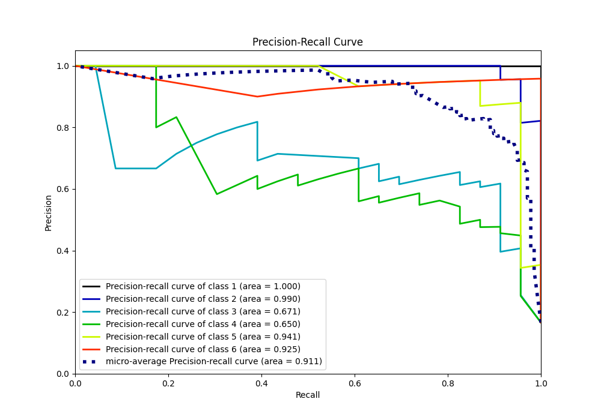

# Summary of 47_ExtraTrees

[<< Go back](../README.md)

## Extra Trees Classifier (Extra Trees)
- **n_jobs**: -1
- **criterion**: gini
- **max_features**: 0.5
- **min_samples_split**: 20
- **max_depth**: 4
- **eval_metric_name**: accuracy
- **num_class**: 6
- **explain_level**: 0

## Validation
 - **validation_type**: kfold
 - **shuffle**: True
 - **stratify**: True
 - **k_folds**: 10

## Optimized metric
accuracy

## Training time

10.8 seconds

### Metric details
|           |         1 |         2 |         3 |         4 |         5 |         6 |   accuracy |   macro avg |   weighted avg |   logloss |
|:----------|----------:|----------:|----------:|----------:|----------:|----------:|-----------:|------------:|---------------:|----------:|
| precision |  0.958333 |  0.92     |  0.730769 |  0.916667 |  0.814815 |  0.958333 |   0.876812 |    0.883153 |       0.883153 |  0.623413 |
| recall    |  1        |  1        |  0.826087 |  0.478261 |  0.956522 |  1        |   0.876812 |    0.876812 |       0.876812 |  0.623413 |
| f1-score  |  0.978723 |  0.958333 |  0.77551  |  0.628571 |  0.88     |  0.978723 |   0.876812 |    0.866644 |       0.866644 |  0.623413 |
| support   | 23        | 23        | 23        | 23        | 23        | 23        |   0.876812 |  138        |     138        |  0.623413 |

## Confusion matrix
|              |   Predicted as 1 |   Predicted as 2 |   Predicted as 3 |   Predicted as 4 |   Predicted as 5 |   Predicted as 6 |
|:-------------|-----------------:|-----------------:|-----------------:|-----------------:|-----------------:|-----------------:|
| Labeled as 1 |               23 |                0 |                0 |                0 |                0 |                0 |
| Labeled as 2 |                0 |               23 |                0 |                0 |                0 |                0 |
| Labeled as 3 |                1 |                2 |               19 |                1 |                0 |                0 |
| Labeled as 4 |                0 |                0 |                6 |               11 |                5 |                1 |
| Labeled as 5 |                0 |                0 |                1 |                0 |               22 |                0 |
| Labeled as 6 |                0 |                0 |                0 |                0 |                0 |               23 |

## Learning curves

## Confusion Matrix

## Normalized Confusion Matrix

## ROC Curve

## Precision Recall Curve

[<< Go back](../README.md)
