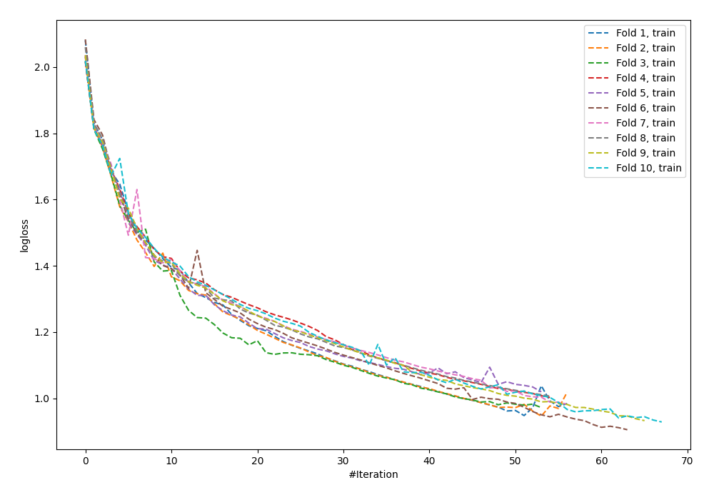
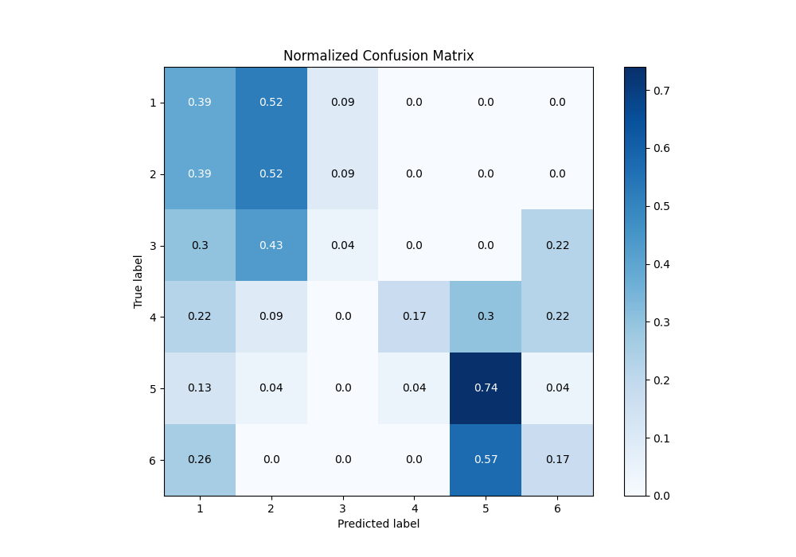
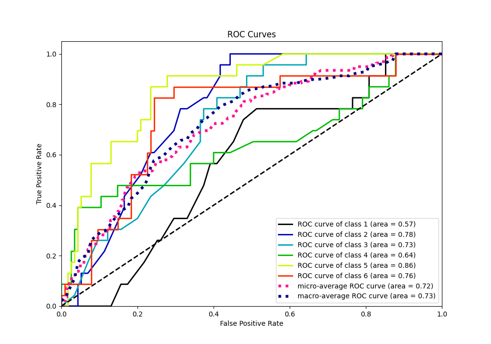
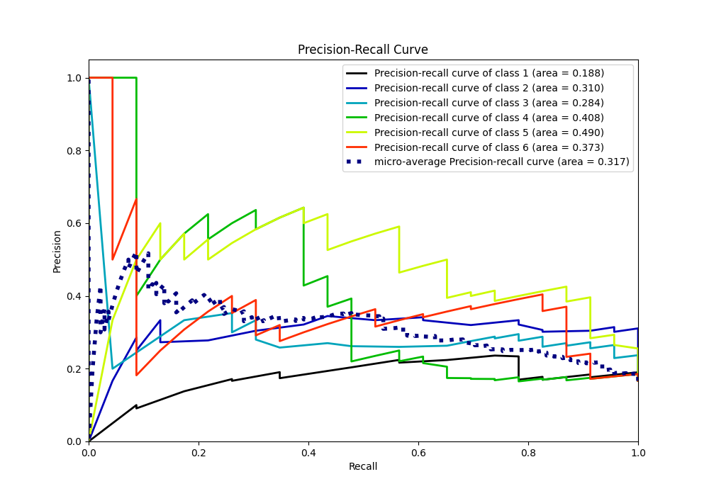

# Summary of 56_NeuralNetwork

[<< Go back](../README.md)

## Neural Network
- **n_jobs**: -1
- **dense_1_size**: 32
- **dense_2_size**: 4
- **learning_rate**: 0.05
- **num_class**: 6
- **explain_level**: 0

## Validation
 - **validation_type**: kfold
 - **shuffle**: True
 - **stratify**: True
 - **k_folds**: 10

## Optimized metric
accuracy

## Training time

6.1 seconds

### Metric details
|           |         1 |         2 |          3 |         4 |         5 |         6 |   accuracy |   macro avg |   weighted avg |   logloss |
|:----------|----------:|----------:|-----------:|----------:|----------:|----------:|-----------:|------------:|---------------:|----------:|
| precision |  0.230769 |  0.324324 |  0.2       |  0.8      |  0.459459 |  0.266667 |    0.34058 |    0.380203 |       0.380203 |   1.60302 |
| recall    |  0.391304 |  0.521739 |  0.0434783 |  0.173913 |  0.73913  |  0.173913 |    0.34058 |    0.34058  |       0.34058  |   1.60302 |
| f1-score  |  0.290323 |  0.4      |  0.0714286 |  0.285714 |  0.566667 |  0.210526 |    0.34058 |    0.30411  |       0.30411  |   1.60302 |
| support   | 23        | 23        | 23         | 23        | 23        | 23        |    0.34058 |  138        |     138        |   1.60302 |

## Confusion matrix
|              |   Predicted as 1 |   Predicted as 2 |   Predicted as 3 |   Predicted as 4 |   Predicted as 5 |   Predicted as 6 |
|:-------------|-----------------:|-----------------:|-----------------:|-----------------:|-----------------:|-----------------:|
| Labeled as 1 |                9 |               12 |                2 |                0 |                0 |                0 |
| Labeled as 2 |                9 |               12 |                2 |                0 |                0 |                0 |
| Labeled as 3 |                7 |               10 |                1 |                0 |                0 |                5 |
| Labeled as 4 |                5 |                2 |                0 |                4 |                7 |                5 |
| Labeled as 5 |                3 |                1 |                0 |                1 |               17 |                1 |
| Labeled as 6 |                6 |                0 |                0 |                0 |               13 |                4 |

## Learning curves

## Confusion Matrix

## Normalized Confusion Matrix

## ROC Curve

## Precision Recall Curve

[<< Go back](../README.md)
