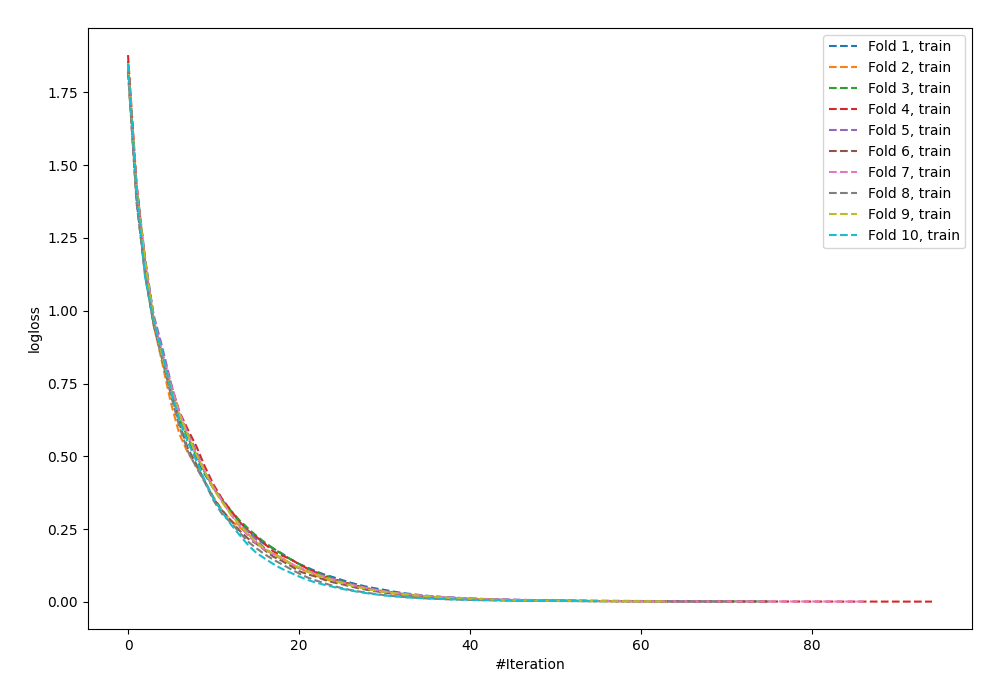
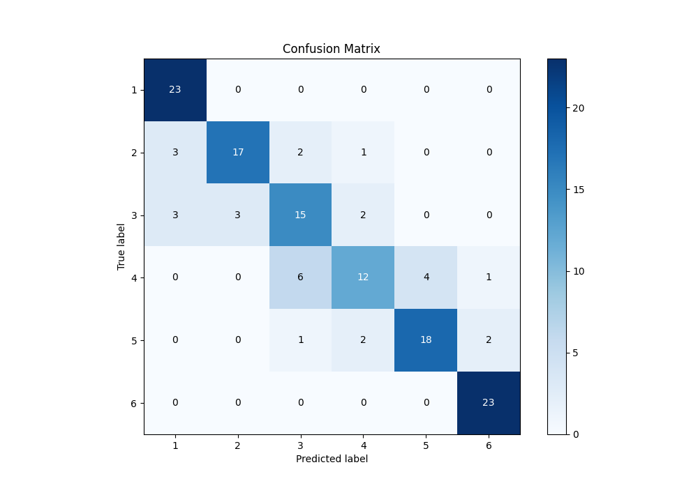
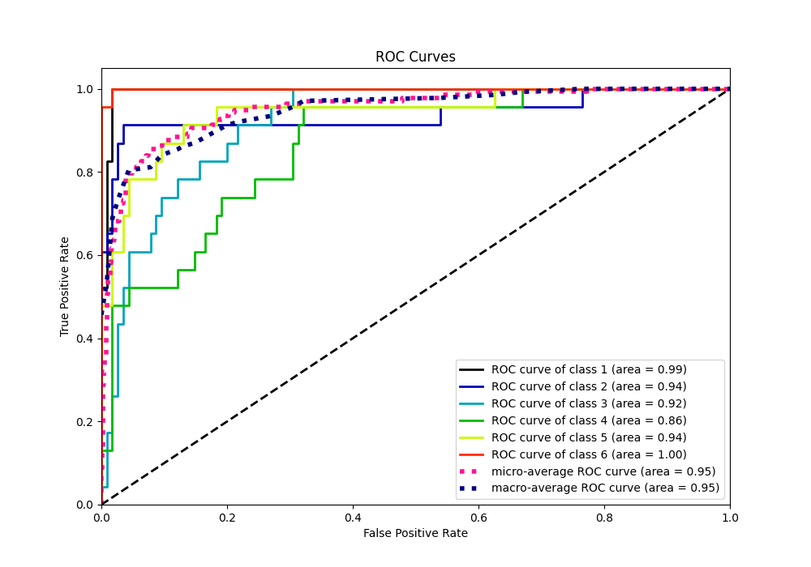
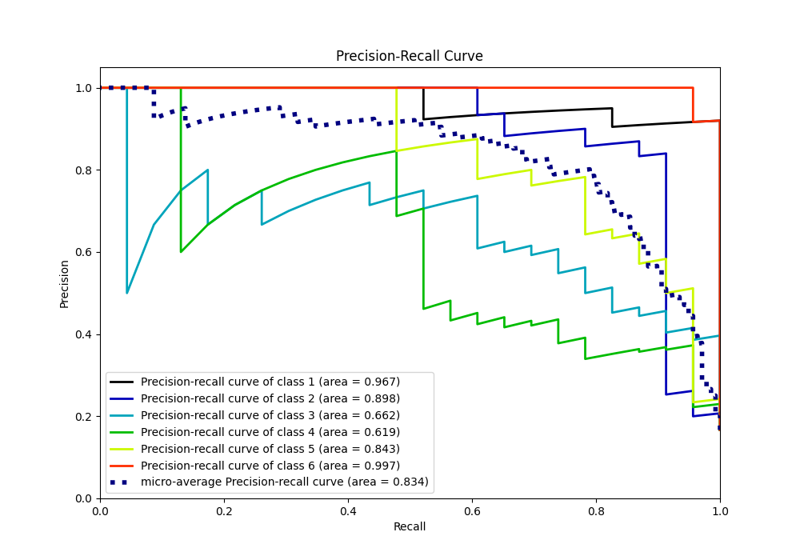

# Summary of 57_NeuralNetwork

[<< Go back](../README.md)

## Neural Network
- **n_jobs**: -1
- **dense_1_size**: 64
- **dense_2_size**: 16
- **learning_rate**: 0.01
- **num_class**: 6
- **explain_level**: 0

## Validation
 - **validation_type**: kfold
 - **shuffle**: True
 - **stratify**: True
 - **k_folds**: 10

## Optimized metric
accuracy

## Training time

7.3 seconds

### Metric details
|           |         1 |         2 |         3 |         4 |         5 |         6 |   accuracy |   macro avg |   weighted avg |   logloss |
|:----------|----------:|----------:|----------:|----------:|----------:|----------:|-----------:|------------:|---------------:|----------:|
| precision |  0.793103 |  0.85     |  0.625    |  0.705882 |  0.818182 |  0.884615 |   0.782609 |    0.779464 |       0.779464 |  0.809417 |
| recall    |  1        |  0.73913  |  0.652174 |  0.521739 |  0.782609 |  1        |   0.782609 |    0.782609 |       0.782609 |  0.809417 |
| f1-score  |  0.884615 |  0.790698 |  0.638298 |  0.6      |  0.8      |  0.938776 |   0.782609 |    0.775398 |       0.775398 |  0.809417 |
| support   | 23        | 23        | 23        | 23        | 23        | 23        |   0.782609 |  138        |     138        |  0.809417 |

## Confusion matrix
|              |   Predicted as 1 |   Predicted as 2 |   Predicted as 3 |   Predicted as 4 |   Predicted as 5 |   Predicted as 6 |
|:-------------|-----------------:|-----------------:|-----------------:|-----------------:|-----------------:|-----------------:|
| Labeled as 1 |               23 |                0 |                0 |                0 |                0 |                0 |
| Labeled as 2 |                3 |               17 |                2 |                1 |                0 |                0 |
| Labeled as 3 |                3 |                3 |               15 |                2 |                0 |                0 |
| Labeled as 4 |                0 |                0 |                6 |               12 |                4 |                1 |
| Labeled as 5 |                0 |                0 |                1 |                2 |               18 |                2 |
| Labeled as 6 |                0 |                0 |                0 |                0 |                0 |               23 |

## Learning curves

## Confusion Matrix

## Normalized Confusion Matrix

## ROC Curve

## Precision Recall Curve

[<< Go back](../README.md)
