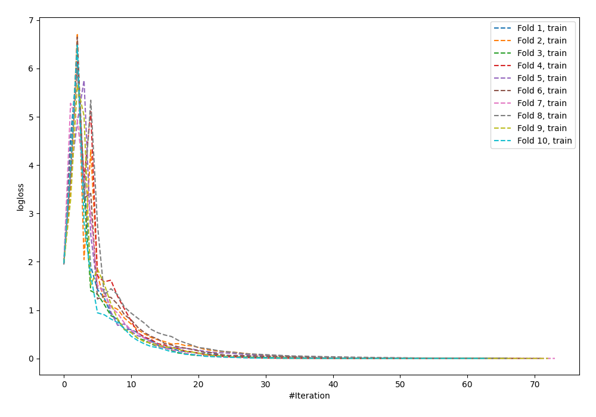
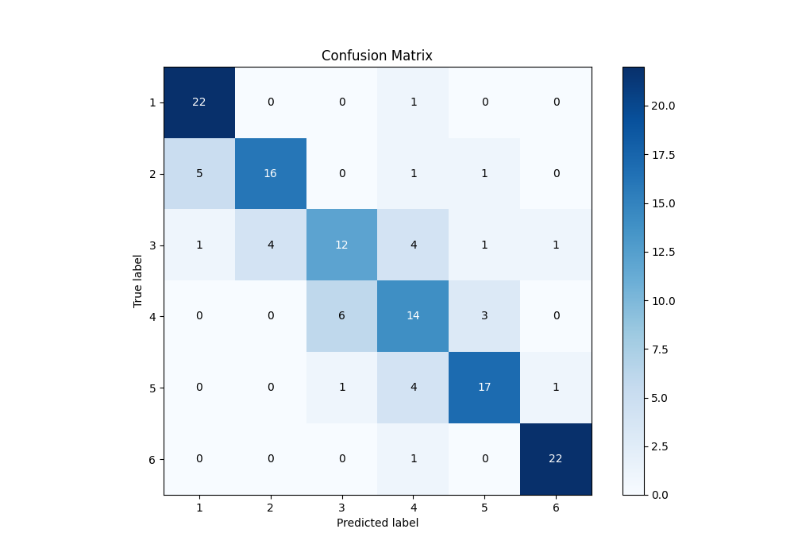
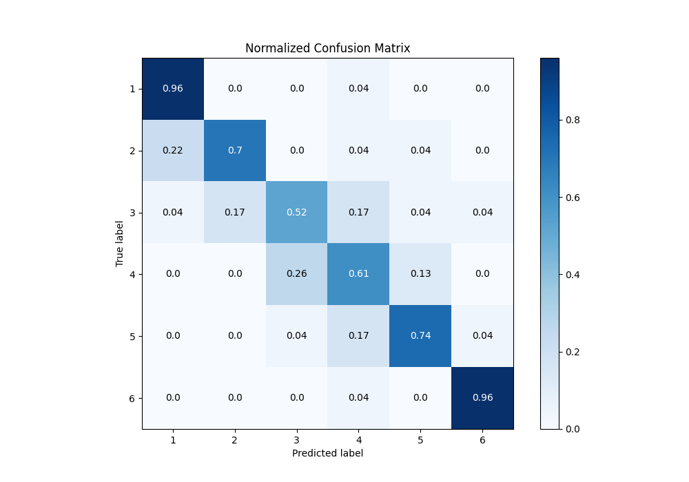
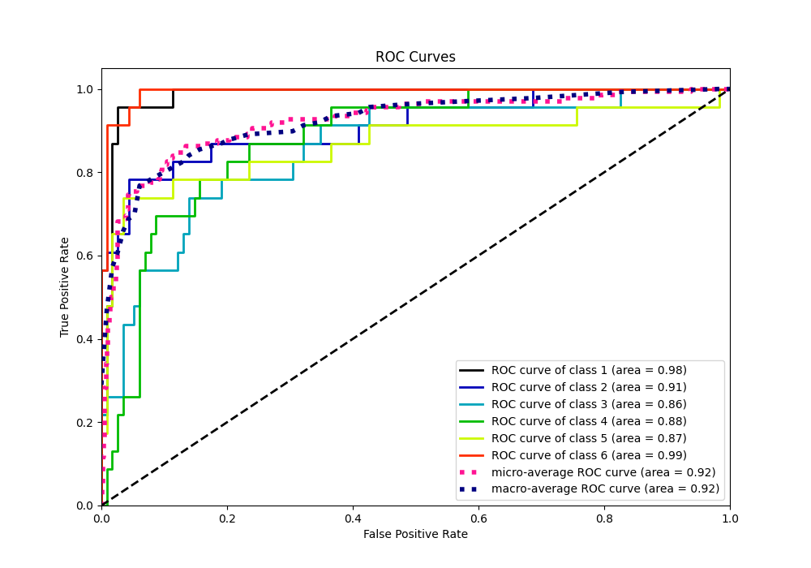
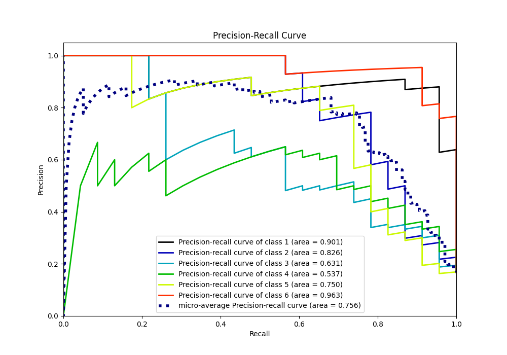

# Summary of 58_NeuralNetwork

[<< Go back](../README.md)

## Neural Network
- **n_jobs**: -1
- **dense_1_size**: 64
- **dense_2_size**: 32
- **learning_rate**: 0.08
- **num_class**: 6
- **explain_level**: 0

## Validation
 - **validation_type**: kfold
 - **shuffle**: True
 - **stratify**: True
 - **k_folds**: 10

## Optimized metric
accuracy

## Training time

8.1 seconds

### Metric details
|           |         1 |         2 |         3 |         4 |         5 |         6 |   accuracy |   macro avg |   weighted avg |   logloss |
|:----------|----------:|----------:|----------:|----------:|----------:|----------:|-----------:|------------:|---------------:|----------:|
| precision |  0.785714 |  0.8      |  0.631579 |  0.56     |  0.772727 |  0.916667 |   0.746377 |    0.744448 |       0.744448 |   1.23747 |
| recall    |  0.956522 |  0.695652 |  0.521739 |  0.608696 |  0.73913  |  0.956522 |   0.746377 |    0.746377 |       0.746377 |   1.23747 |
| f1-score  |  0.862745 |  0.744186 |  0.571429 |  0.583333 |  0.755556 |  0.93617  |   0.746377 |    0.742236 |       0.742236 |   1.23747 |
| support   | 23        | 23        | 23        | 23        | 23        | 23        |   0.746377 |  138        |     138        |   1.23747 |

## Confusion matrix
|              |   Predicted as 1 |   Predicted as 2 |   Predicted as 3 |   Predicted as 4 |   Predicted as 5 |   Predicted as 6 |
|:-------------|-----------------:|-----------------:|-----------------:|-----------------:|-----------------:|-----------------:|
| Labeled as 1 |               22 |                0 |                0 |                1 |                0 |                0 |
| Labeled as 2 |                5 |               16 |                0 |                1 |                1 |                0 |
| Labeled as 3 |                1 |                4 |               12 |                4 |                1 |                1 |
| Labeled as 4 |                0 |                0 |                6 |               14 |                3 |                0 |
| Labeled as 5 |                0 |                0 |                1 |                4 |               17 |                1 |
| Labeled as 6 |                0 |                0 |                0 |                1 |                0 |               22 |

## Learning curves

## Confusion Matrix

## Normalized Confusion Matrix

## ROC Curve

## Precision Recall Curve

[<< Go back](../README.md)
