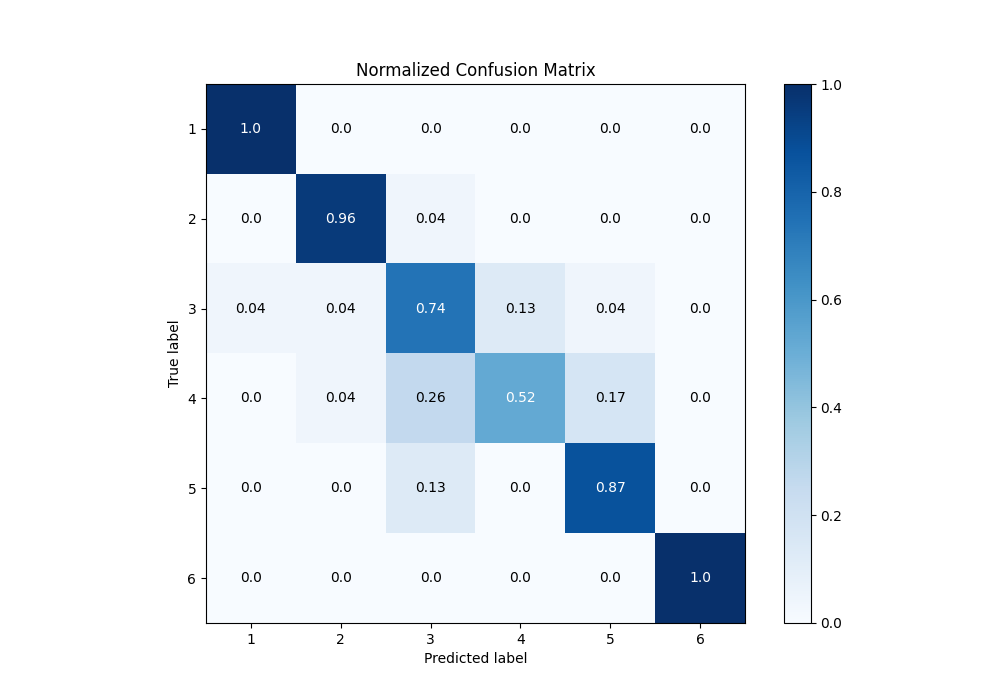

# Summary of 6_Default_Xgboost

[<< Go back](../README.md)

## Extreme Gradient Boosting (Xgboost)
- **n_jobs**: -1
- **objective**: multi:softprob
- **eta**: 0.075
- **max_depth**: 6
- **min_child_weight**: 1
- **subsample**: 1.0
- **colsample_bytree**: 1.0
- **eval_metric**: accuracy
- **num_class**: 6
- **explain_level**: 0

## Validation
 - **validation_type**: kfold
 - **shuffle**: True
 - **stratify**: True
 - **k_folds**: 10

## Optimized metric
accuracy

## Training time

8.3 seconds

### Metric details
|           |         1 |         2 |        3 |         4 |         5 |   6 |   accuracy |   macro avg |   weighted avg |   logloss |
|:----------|----------:|----------:|---------:|----------:|----------:|----:|-----------:|------------:|---------------:|----------:|
| precision |  0.958333 |  0.916667 |  0.62963 |  0.8      |  0.8      |   1 |   0.847826 |    0.850772 |       0.850772 |   1.25187 |
| recall    |  1        |  0.956522 |  0.73913 |  0.521739 |  0.869565 |   1 |   0.847826 |    0.847826 |       0.847826 |   1.25187 |
| f1-score  |  0.978723 |  0.93617  |  0.68    |  0.631579 |  0.833333 |   1 |   0.847826 |    0.843301 |       0.843301 |   1.25187 |
| support   | 23        | 23        | 23       | 23        | 23        |  23 |   0.847826 |  138        |     138        |   1.25187 |

## Confusion matrix
|              |   Predicted as 1 |   Predicted as 2 |   Predicted as 3 |   Predicted as 4 |   Predicted as 5 |   Predicted as 6 |
|:-------------|-----------------:|-----------------:|-----------------:|-----------------:|-----------------:|-----------------:|
| Labeled as 1 |               23 |                0 |                0 |                0 |                0 |                0 |
| Labeled as 2 |                0 |               22 |                1 |                0 |                0 |                0 |
| Labeled as 3 |                1 |                1 |               17 |                3 |                1 |                0 |
| Labeled as 4 |                0 |                1 |                6 |               12 |                4 |                0 |
| Labeled as 5 |                0 |                0 |                3 |                0 |               20 |                0 |
| Labeled as 6 |                0 |                0 |                0 |                0 |                0 |               23 |

## Learning curves

## Confusion Matrix

## Normalized Confusion Matrix

## ROC Curve

## Precision Recall Curve

[<< Go back](../README.md)
