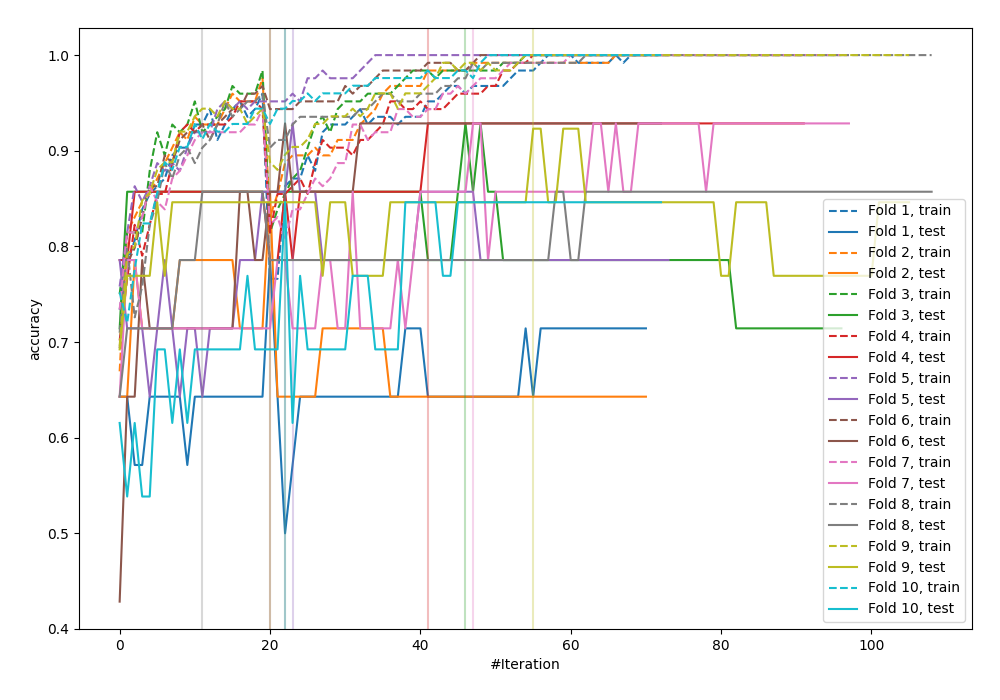
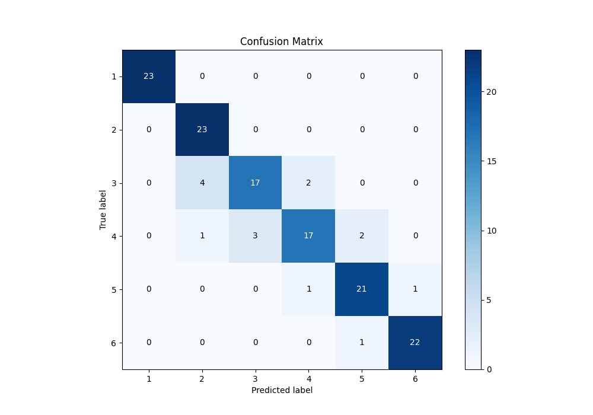
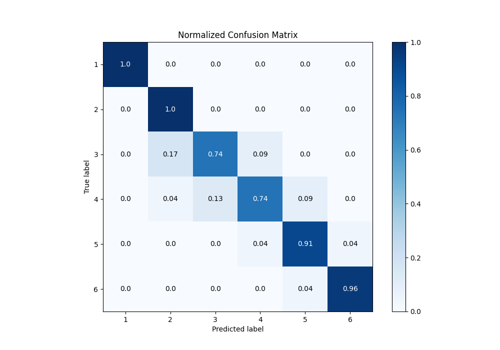
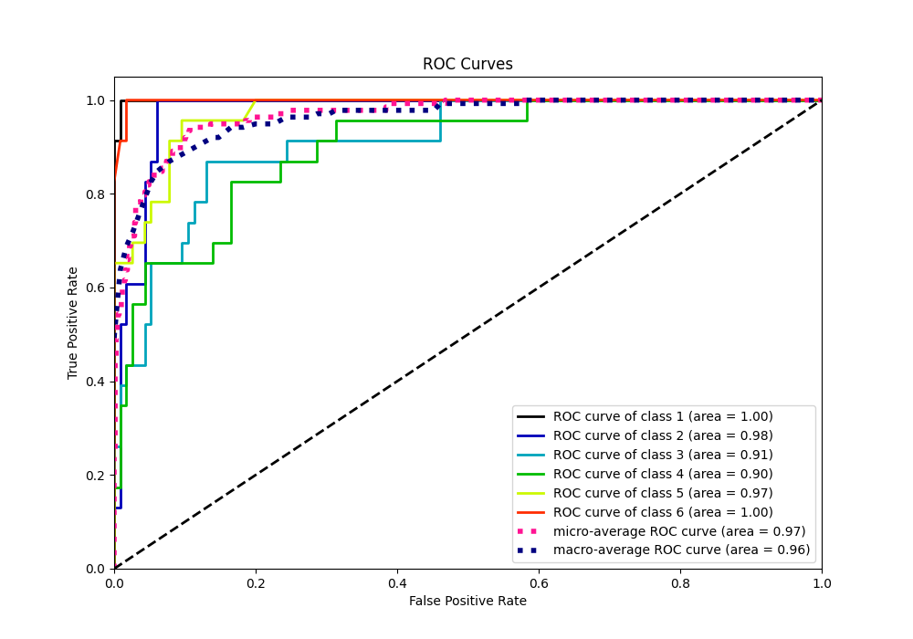
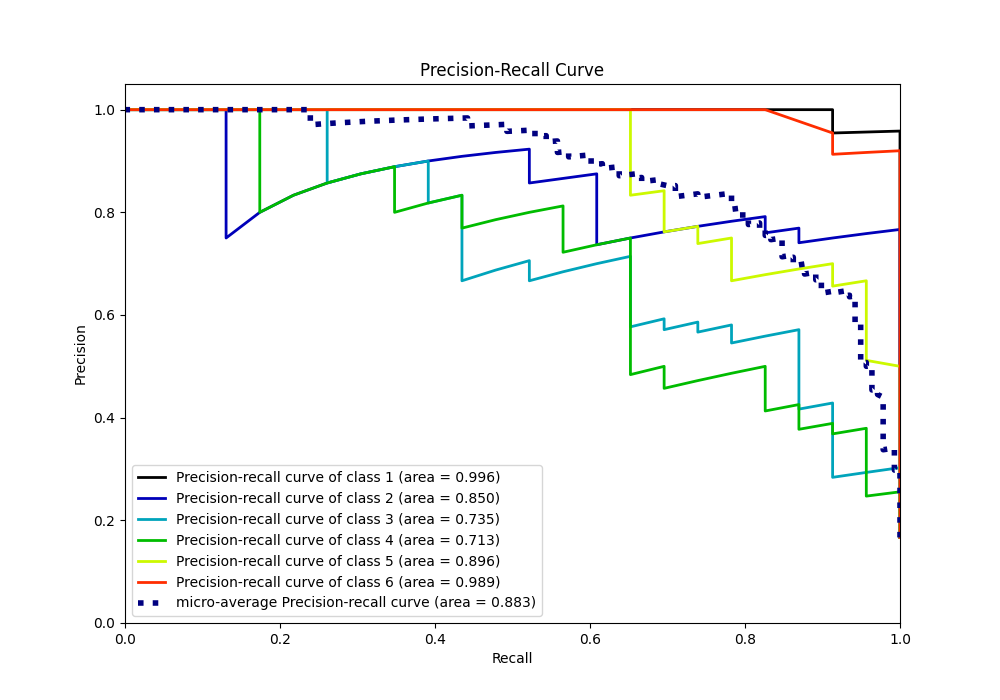

# Summary of 7_Default_CatBoost

[<< Go back](../README.md)

## CatBoost
- **n_jobs**: -1
- **learning_rate**: 0.15
- **depth**: 5
- **rsm**: 1
- **loss_function**: MultiClass
- **eval_metric**: Accuracy
- **num_class**: 6
- **explain_level**: 0

## Validation
 - **validation_type**: kfold
 - **shuffle**: True
 - **stratify**: True
 - **k_folds**: 10

## Optimized metric
accuracy

## Training time

50.8 seconds

### Metric details
|           |   1 |         2 |         3 |         4 |         5 |         6 |   accuracy |   macro avg |   weighted avg |   logloss |
|:----------|----:|----------:|----------:|----------:|----------:|----------:|-----------:|------------:|---------------:|----------:|
| precision |   1 |  0.821429 |  0.85     |  0.85     |  0.875    |  0.956522 |   0.891304 |    0.892158 |       0.892158 |  0.845734 |
| recall    |   1 |  1        |  0.73913  |  0.73913  |  0.913043 |  0.956522 |   0.891304 |    0.891304 |       0.891304 |  0.845734 |
| f1-score  |   1 |  0.901961 |  0.790698 |  0.790698 |  0.893617 |  0.956522 |   0.891304 |    0.888916 |       0.888916 |  0.845734 |
| support   |  23 | 23        | 23        | 23        | 23        | 23        |   0.891304 |  138        |     138        |  0.845734 |

## Confusion matrix
|              |   Predicted as 1 |   Predicted as 2 |   Predicted as 3 |   Predicted as 4 |   Predicted as 5 |   Predicted as 6 |
|:-------------|-----------------:|-----------------:|-----------------:|-----------------:|-----------------:|-----------------:|
| Labeled as 1 |               23 |                0 |                0 |                0 |                0 |                0 |
| Labeled as 2 |                0 |               23 |                0 |                0 |                0 |                0 |
| Labeled as 3 |                0 |                4 |               17 |                2 |                0 |                0 |
| Labeled as 4 |                0 |                1 |                3 |               17 |                2 |                0 |
| Labeled as 5 |                0 |                0 |                0 |                1 |               21 |                1 |
| Labeled as 6 |                0 |                0 |                0 |                0 |                1 |               22 |

## Learning curves

## Confusion Matrix

## Normalized Confusion Matrix

## ROC Curve

## Precision Recall Curve

[<< Go back](../README.md)
