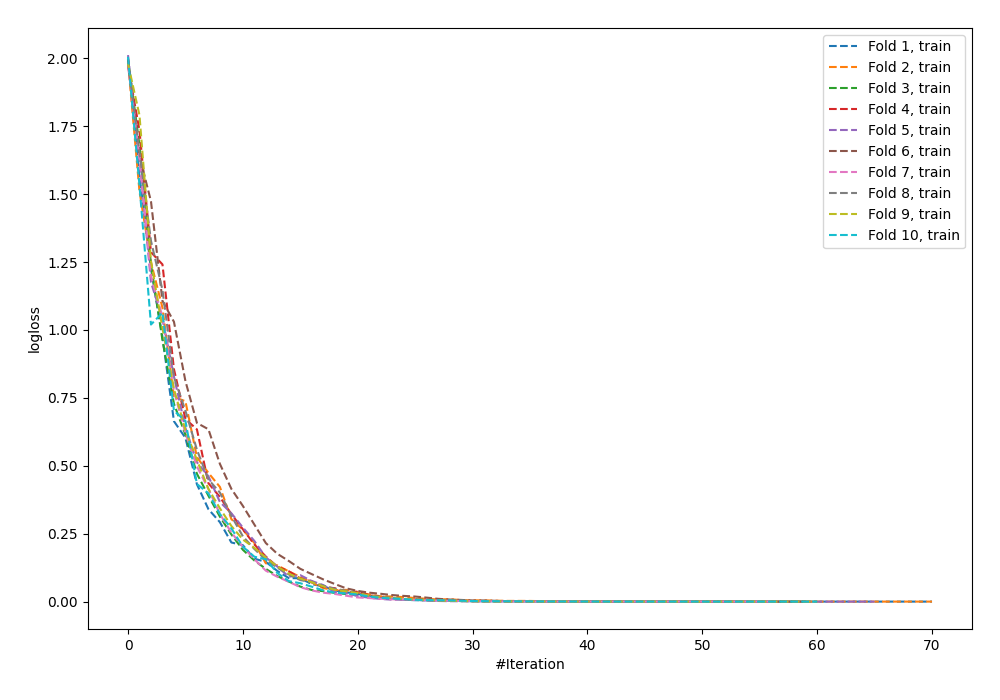
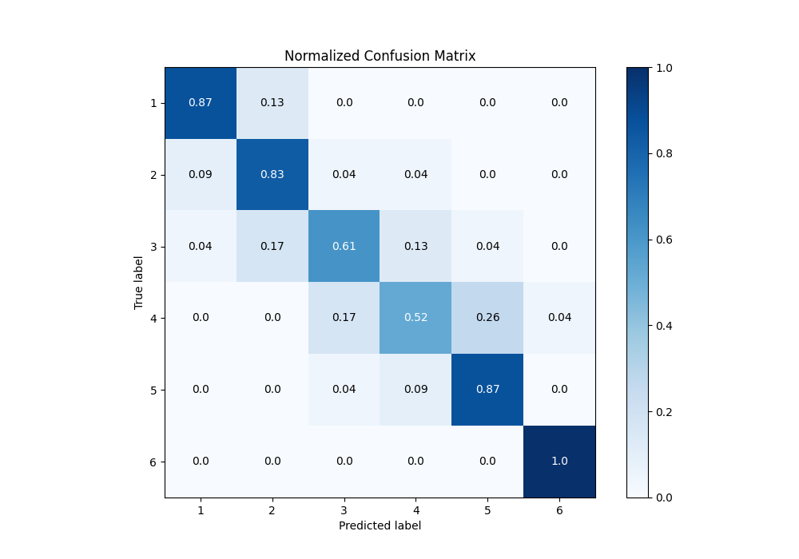
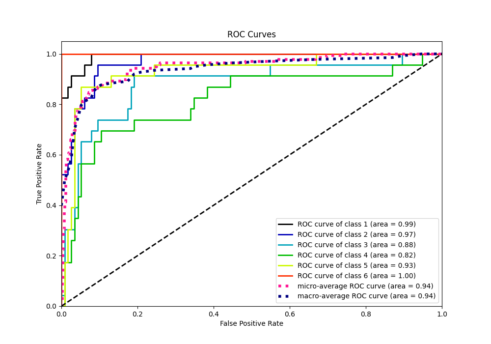
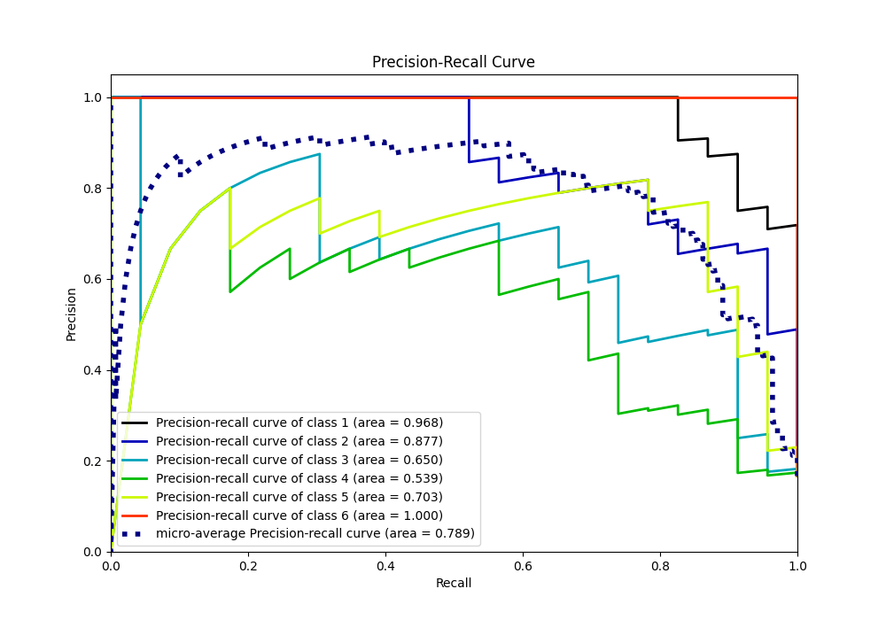

# Summary of 8_Default_NeuralNetwork

[<< Go back](../README.md)

## Neural Network
- **n_jobs**: -1
- **dense_1_size**: 32
- **dense_2_size**: 16
- **learning_rate**: 0.05
- **num_class**: 6
- **explain_level**: 0

## Validation
 - **validation_type**: kfold
 - **shuffle**: True
 - **stratify**: True
 - **k_folds**: 10

## Optimized metric
accuracy

## Training time

5.1 seconds

### Metric details
|           |         1 |         2 |         3 |         4 |         5 |         6 |   accuracy |   macro avg |   weighted avg |   logloss |
|:----------|----------:|----------:|----------:|----------:|----------:|----------:|-----------:|------------:|---------------:|----------:|
| precision |  0.869565 |  0.730769 |  0.7      |  0.666667 |  0.740741 |  0.958333 |   0.782609 |    0.777679 |       0.777679 |  0.962018 |
| recall    |  0.869565 |  0.826087 |  0.608696 |  0.521739 |  0.869565 |  1        |   0.782609 |    0.782609 |       0.782609 |  0.962018 |
| f1-score  |  0.869565 |  0.77551  |  0.651163 |  0.585366 |  0.8      |  0.978723 |   0.782609 |    0.776721 |       0.776721 |  0.962018 |
| support   | 23        | 23        | 23        | 23        | 23        | 23        |   0.782609 |  138        |     138        |  0.962018 |

## Confusion matrix
|              |   Predicted as 1 |   Predicted as 2 |   Predicted as 3 |   Predicted as 4 |   Predicted as 5 |   Predicted as 6 |
|:-------------|-----------------:|-----------------:|-----------------:|-----------------:|-----------------:|-----------------:|
| Labeled as 1 |               20 |                3 |                0 |                0 |                0 |                0 |
| Labeled as 2 |                2 |               19 |                1 |                1 |                0 |                0 |
| Labeled as 3 |                1 |                4 |               14 |                3 |                1 |                0 |
| Labeled as 4 |                0 |                0 |                4 |               12 |                6 |                1 |
| Labeled as 5 |                0 |                0 |                1 |                2 |               20 |                0 |
| Labeled as 6 |                0 |                0 |                0 |                0 |                0 |               23 |

## Learning curves

## Confusion Matrix

## Normalized Confusion Matrix

## ROC Curve

## Precision Recall Curve

[<< Go back](../README.md)
