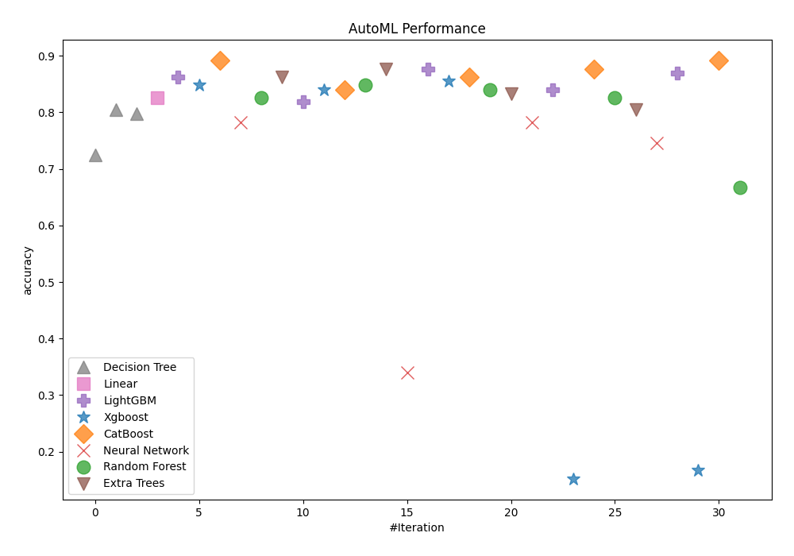
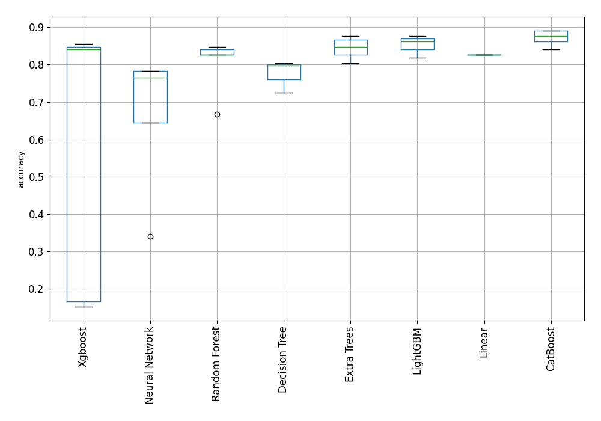

# AutoML Leaderboard

| Best model   | name                                                         | model_type     | metric_type   |   metric_value |   train_time |
|:-------------|:-------------------------------------------------------------|:---------------|:--------------|---------------:|-------------:|
|              | [1_DecisionTree](1_DecisionTree/README.md)                   | Decision Tree  | accuracy      |       0.724638 |         4.2  |
|              | [2_DecisionTree](2_DecisionTree/README.md)                   | Decision Tree  | accuracy      |       0.804348 |         3.65 |
|              | [3_DecisionTree](3_DecisionTree/README.md)                   | Decision Tree  | accuracy      |       0.797101 |         3.78 |
|              | [4_Linear](4_Linear/README.md)                               | Linear         | accuracy      |       0.826087 |         8.47 |
|              | [5_Default_LightGBM](5_Default_LightGBM/README.md)           | LightGBM       | accuracy      |       0.862319 |         6.21 |
|              | [6_Default_Xgboost](6_Default_Xgboost/README.md)             | Xgboost        | accuracy      |       0.847826 |         9.09 |
| **the best** | [7_Default_CatBoost](7_Default_CatBoost/README.md)           | CatBoost       | accuracy      |       0.891304 |        51.7  |
|              | [8_Default_NeuralNetwork](8_Default_NeuralNetwork/README.md) | Neural Network | accuracy      |       0.782609 |         5.78 |
|              | [9_Default_RandomForest](9_Default_RandomForest/README.md)   | Random Forest  | accuracy      |       0.826087 |        11.57 |
|              | [10_Default_ExtraTrees](10_Default_ExtraTrees/README.md)     | Extra Trees    | accuracy      |       0.862319 |        10.73 |
|              | [20_LightGBM](20_LightGBM/README.md)                         | LightGBM       | accuracy      |       0.818841 |         6.06 |
|              | [11_Xgboost](11_Xgboost/README.md)                           | Xgboost        | accuracy      |       0.84058  |         8.4  |
|              | [29_CatBoost](29_CatBoost/README.md)                         | CatBoost       | accuracy      |       0.84058  |        15.08 |
|              | [38_RandomForest](38_RandomForest/README.md)                 | Random Forest  | accuracy      |       0.847826 |        11.98 |
|              | [47_ExtraTrees](47_ExtraTrees/README.md)                     | Extra Trees    | accuracy      |       0.876812 |        11.6  |
|              | [56_NeuralNetwork](56_NeuralNetwork/README.md)               | Neural Network | accuracy      |       0.34058  |         6.81 |
|              | [21_LightGBM](21_LightGBM/README.md)                         | LightGBM       | accuracy      |       0.876812 |         7.56 |
|              | [12_Xgboost](12_Xgboost/README.md)                           | Xgboost        | accuracy      |       0.855072 |        13.42 |
|              | [30_CatBoost](30_CatBoost/README.md)                         | CatBoost       | accuracy      |       0.862319 |        33.76 |
|              | [39_RandomForest](39_RandomForest/README.md)                 | Random Forest  | accuracy      |       0.84058  |        13.24 |
|              | [48_ExtraTrees](48_ExtraTrees/README.md)                     | Extra Trees    | accuracy      |       0.833333 |        12.27 |
|              | [57_NeuralNetwork](57_NeuralNetwork/README.md)               | Neural Network | accuracy      |       0.782609 |         8    |
|              | [22_LightGBM](22_LightGBM/README.md)                         | LightGBM       | accuracy      |       0.84058  |         7.96 |
|              | [13_Xgboost](13_Xgboost/README.md)                           | Xgboost        | accuracy      |       0.152174 |         8.64 |
|              | [31_CatBoost](31_CatBoost/README.md)                         | CatBoost       | accuracy      |       0.876812 |       102.4  |
|              | [40_RandomForest](40_RandomForest/README.md)                 | Random Forest  | accuracy      |       0.826087 |        14.44 |
|              | [49_ExtraTrees](49_ExtraTrees/README.md)                     | Extra Trees    | accuracy      |       0.804348 |        12.92 |
|              | [58_NeuralNetwork](58_NeuralNetwork/README.md)               | Neural Network | accuracy      |       0.746377 |         8.84 |
|              | [23_LightGBM](23_LightGBM/README.md)                         | LightGBM       | accuracy      |       0.869565 |        10.13 |
|              | [14_Xgboost](14_Xgboost/README.md)                           | Xgboost        | accuracy      |       0.166667 |         8.93 |
|              | [32_CatBoost](32_CatBoost/README.md)                         | CatBoost       | accuracy      |       0.891304 |        91.47 |
|              | [41_RandomForest](41_RandomForest/README.md)                 | Random Forest  | accuracy      |       0.666667 |        15.24 |

### AutoML Performance

### AutoML Performance Boxplot
